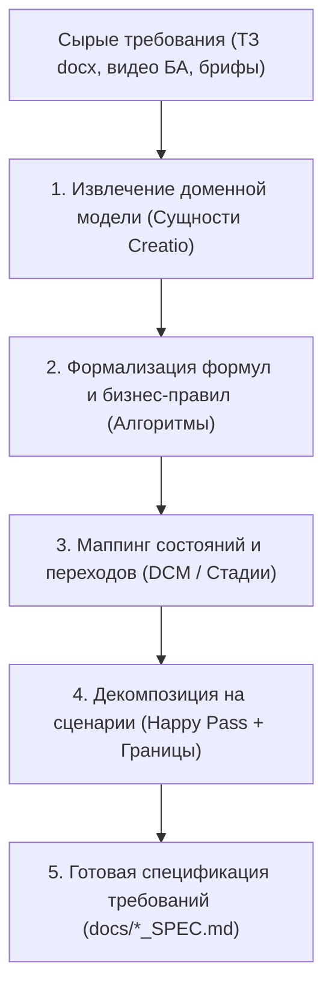

# 🧠 BMAD Requirements Analyst Standard (Analyst Role)

Данный скилл реализует роль **Requirements Analyst** из методологии **BMAD**. Он предназначен для анализа бизнес-требований, видеоинструкций, документов ТЗ (`docs/*.docx`) и их преобразования в формальные спецификации для тестирования и разработки.

---

## 🧭 1. Основной рабочий процесс (Workflow)



---

## 📋 2. Алгоритм анализа требований по шагам

### Шаг 1. Анализ входных источников
При получении нового ТЗ или описания фичи:
1. Проверить наличие документов в папке `docs/` (например, `PLANNING_BLOCK_ALGORITHMS_TEST_PLAN.md` или `*.docx`).
2. Зафиксировать автора, дату, цели доработки и границы скоупа.

### Шаг 2. Выделение сущностей и полей Creatio
Сопоставить термины из ТЗ с техническими названиями в Creatio:
* *«Готовая продукция»* ➔ `Product` (Категория: `Готовий продукт`, `Products_FormPage`).
* *«Технологическая карта»* ➔ `GenProductionRouting` (`#Section/GenProductionRouting_ListPage`).
* *«План производства»* ➔ `GenProductionPlan` (`#Section/GenProductionPlan_ListPage`).
* *«Робочі зміни»* ➔ `GenWorkShift`.

### Шаг 3. Математическая формализация правил и формул
Все расчетные алгоритмы должны быть записаны в явном математическом виде:
* **Формулы расчета дефицита:**
  $$\text{Чистий дефіцит} = \text{Повна потреба} - \sum(\text{Скориговані кількості попередніх планів})$$
* **Формула загрузки оборудования:**
  $$\% \text{ завантаження} = \frac{\text{Кількість з ВЗ}}{\text{Потужність / Продуктивність}} \times 100$$
* **Формулы интерполяции и граничные условия:**
  Четкая фиксация точек $Min (50\%)$, $Mid (75\%)$, $Max (95\%)$.

### Шаг 4. Анализ жизненного цикла (State Machine)
Определить возможные статусы и правила переходов:
* Черновик (`Чернетка`) ➔ Кнопка «Запланувати» ➔ В процессе (`В процесі`) ➔ Кнопка «Затвердити» ➔ Затверджено (🔒 Read-Only).

---

## 📝 3. Шаблон итогового документа требований (`REQUIREMENTS_SPEC.md`)

```markdown
# 📄 Спецификация бизнес-требований: [Название функционала]

> **Источник:** [Документ ТЗ / Видеозапись]  
> **Аналитик:** BMAD Analyst Agent  
> **Статус:** `Утверждено`

---

## 🎯 1. Бизнес-цель
[Краткое описание бизнес-задачи, которую решает данный модуль/алгоритм].

---

## 🏛️ 2. Участвующие сущности Creatio
| Сущность | Схема Creatio | Назначение в процессе |
| :--- | :--- | :--- |
| **План производства** | `GenProductionPlan` | Агрегатор недельной потребности |
| **Оборудование** | `GenEquipment` | Станки и линии для подбора |

---

## 🧮 3. Бизнес-правила и формулы
### Правило 1. [Название правила]
* **Условие:** Если `[Field]` > `[Value]`.
* **Формула:**
  $$\text{Результат} = A \times B + C$$
* **Исключения:** [Описать, если есть].

---

## 🚦 4. Acceptance Criteria (Критерии приемки)
* [ ] **AC-01:** При нажатии «Запланувати» создаются замовлення в статусе `Чернетка`.
* [ ] **AC-02:** Если оборудование загружено >80%, выводится модальное окно с текстом *«Обладнання вже завантажено більше ніж на 80%. Продовжити?»*.
* [ ] **AC-03:** После утверждения плана все поля шапки блокируются для редактирования.

---

## 🔄 5. Связь с тест-дизайном
Спецификация передается в скилл `bmad-test-docs` для формирования тест-кейсов TS1..TS[N].
```
