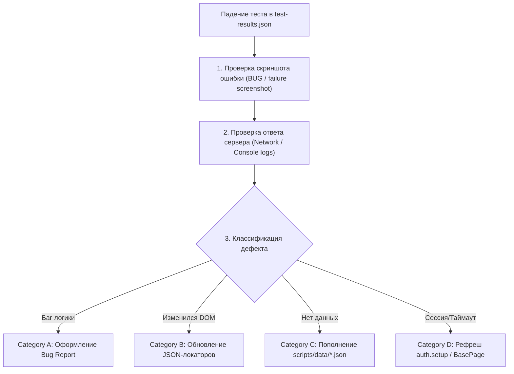

# 🔍 BMAD Root Cause Analysis & Defect Investigator (RCA Role)

Данный скилл реализует процесс **Root Cause Analysis (RCA)** из методологии **BMAD TEA**. Он используется при падении автотестов для мгновенной классификации причин сбоя и подготовки исчерпывающих дефект-репортов.

---

## 🧭 1. Матрица классификации дефектов (RCA Matrix)

Каждое падение автотеста обязано классифицироваться по одной из 4 категорий:

| Категория | Тип проблемы | Признаки в логах / скриншотах | Что делать |
| :--- | :--- | :--- | :--- |
| **🔴 Category A: Product Bug (Баг системы)** | Ошибка в логике Creatio, серверная ошибка, неверный математический расчет, сбой сохранения. | `500 Internal Server Error`, сообщение валидации Creatio, неверная итоговая сумма, зависшая транзакция. | Зафиксировать `BUG_REPORT.md` со скриншотом и передать разработчикам Creatio. |
| **🟡 Category B: UI / Locator Flake** | Изменилась верстка Creatio, переименован заголовок поля, смена Shadow DOM / CSS-классов. | `TimeoutError: locator.waitFor()`, элемент не найден по тексту или placeholder, изменился тег. | Запустить сканер полей `src/utils/scan*.ts` и обновить JSON-словарь в `src/locators/`. |
| **🟠 Category C: Seed / Test Data Issue** | В базе Creatio отсутствуют необходимые родительские данные (нет сырья, не создано оборудование, не утвержден план ГП). | Список пуст, комбобокс не содержит нужного значения, блокировка из-за отсутствия техкарты. | Добавить недостающие объекты в `scripts/data/*.json` и запустить соответствующий сид-скрипт `scripts/seeds/0X_*.ts`. |
| **⚪ Category D: Session / Environment** | Обрыв HTTP/2 соединения, истек токен авторизации, блокирующий оверлей (Mask). | `Target closed`, `401 Unauthorized`, `Loader overlay intercepted pointer events`. | Перегенерировать сессию через `auth.setup.ts`, увеличить тайм-аут или добавить `waitForLoadMask()`. |

---

## 🔍 2. Процедура расследования по шагам



### Шаг 1. Анализ скриншота и артефактов
1. Найти скриншот падения в `test-results/` или `screenshots/`.
2. Посмотреть визуальное состояние страницы:
   * Отображается ли красное модальное окно ошибки Creatio?
   * Завис ли серый оверлей загрузки (`crt-loading-mask`)?
   * Выбран ли правильный пункт в комбобоксе?

### Шаг 2. Анализ стектрейса
1. Определить точную строку падения в коде `src/pages/*.ts` или `e2e/*.spec.ts`.
2. Проверить, какое именно поле или селектор не ответил вовремя.

### Шаг 3. Фиксация исправления
* Если **Category B (Локатор):** отредактировать файл в `src/locators/`.
* Если **Category C (Данные):** отредактировать файл в `scripts/data/` (НЕ трогая код скриптов).
* Если **Category A (Баг системы):** сформировать отчет для пользователя.

---

## 📋 3. Шаблон отчета об ошибке (`BUG_REPORT.md`)

```markdown
# 🐞 Отчет о дефекте: [Краткое название бага]

* **Приоритет:** `P0 (Blocker)` | `P1 (Critical)` | `P2 (Major)` | `P3 (Minor)`
* **Категория RCA:** `Category A: Product Bug`
* **Окружение:** `https://xlab-analyst-main.poligon.crmgenesis.com`
* **Тест:** `e2e/functional/[TestName].spec.ts`

---

### 📝 Шаги воспроизведения (Steps to Reproduce)
1. Открыть раздел `[Название раздела]` по URL `[URL]`.
2. Заполнить поле `[Поле]` значением `[Значение]`.
3. Нажать кнопку `[Кнопка]`.

### ❌ Фактический результат (Actual Result)
Появляется модальное окно ошибки: *«Не вдалося зберегти запис: Поле "Код" є обов'язковим»*.

### ✅ Ожидаемый результат (Expected Result)
Запись успешно сохраняется и переходит в статус `[Статус]`.

### 📸 Подтверждающие материалы (Evidence)
* **Скриншот ошибки:** 
* **HTML отчет:** [custom_report.html](file:///Users/bogdansunday/Desktop/IdeaProjects/Xlab/custom_report.html)
```
