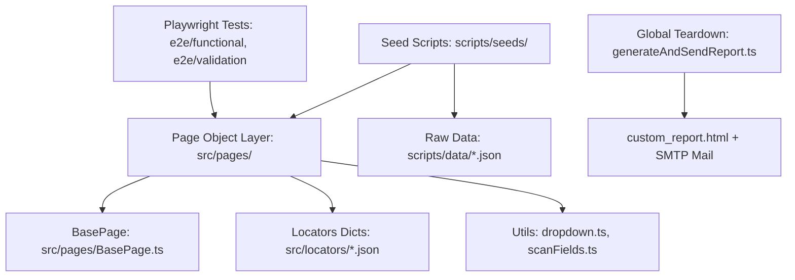

# 🗺️ Xlab Codebase Map & Architecture Topology

Этот скилл содержит полную карту кодовой базы проекта **Xlab**, связывающую разделы Creatio (Freedom UI/Classic), Page Objects, словари локаторов, сид-скрипты и автотесты Playwright.

---

## 🏛️ 1. Архитектура и уровни системы



### Ключевые компоненты:
1. **Config & Environment** ([src/config/environment.ts](file:///Users/bogdansunday/Desktop/IdeaProjects/Xlab/src/config/environment.ts)):
   - Поддержка серверов `main` (`https://xlab-analyst-main.poligon.crmgenesis.com`) и `main2` (`https://xlab-analyst-main2.poligon.crmgenesis.com`).
   - Изоляция сессий: `storageState-main.json` и `storageState-main2.json`.
   - Хелпер построения URL: `getShellUrl('#Section/...')`.
2. **Базовый Page Object** ([src/pages/BasePage.ts](file:///Users/bogdansunday/Desktop/IdeaProjects/Xlab/src/pages/BasePage.ts)):
   - Универсальные методы: `selectComboboxOption`, `setInputValue`, `clickSave`, `takeStepScreenshot`, `verifyFieldsAgainstLocators`, `waitForLoadMask`.
3. **Отчёты и метрики** ([src/utils/generateAndSendReport.ts](file:///Users/bogdansunday/Desktop/IdeaProjects/Xlab/src/utils/generateAndSendReport.ts)):
   - Генерация HTML-дашборда `custom_report.html`, сохранение истории прогонов в `test-history.json`, отправка на email через SMTP.

---

## 📋 2. Матрица сущностей (Domain Mapping Matrix)

Ниже представлена детальная карта связи сущностей Creatio с кодом проекта:

| Раздел Creatio | Page Object (`src/pages/`) | Файл локаторов (`src/locators/`) | Сид-скрипты и данные | E2E Тесты (`e2e/`) | Маршрут Shell URL |
| :--- | :--- | :--- | :--- | :--- | :--- |
| **Продукты (Готовая продукция / ПФ / Сырье)** | [ProductsPage.ts](file:///Users/bogdansunday/Desktop/IdeaProjects/Xlab/src/pages/ProductsPage.ts) | `Продукти.json`, `Продукти_МініСторінка.json` | `scripts/seeds/01_create_semi_finished_products.ts`<br>`scripts/seeds/02_create_finished_products.ts`<br>`scripts/seeds/03_create_raw_materials.ts`<br>`scripts/data/*.json` | `e2e/functional/createSemiFinishedProducts.spec.ts`<br>`e2e/functional/createFinishedProducts.spec.ts`<br>`e2e/validation/productsAllTypesValidation.spec.ts` | `#Section/Products_ListPage` |
| **Категории продуктов** | [ProductsCategoriesPage.ts](file:///Users/bogdansunday/Desktop/IdeaProjects/Xlab/src/pages/ProductsCategoriesPage.ts) | `Продукти_Категорії.json` | — | `e2e/validation/productCategoriesValidation.spec.ts` | `#Lookup/ProductCategory_ListPage` |
| **Технологические карты (Маршрутизация)** | [GenProductionRoutingPage.ts](file:///Users/bogdansunday/Desktop/IdeaProjects/Xlab/src/pages/GenProductionRoutingPage.ts) | `Технологічні_карти.json`, `routing_scanned_fields.json` | `scripts/seeds/03_create_semi_finished_routings.ts`<br>`scripts/seeds/04_create_finished_routings.ts`<br>`scripts/seeds/seedCreateNewRouting.ts` | `e2e/validation/genProductionRoutingValidation.spec.ts` | `#Section/GenProductionRouting_ListPage` |
| **Спецификации (Материалы)** | [ProductMaterialsPage.ts](file:///Users/bogdansunday/Desktop/IdeaProjects/Xlab/src/pages/ProductMaterialsPage.ts) | `characteristics_bottom_texts.json` | `scripts/seeds/05_add_semi_finished_materials.ts`<br>`scripts/seeds/06_add_finished_materials.ts` | — | Вкладка «Матеріали» в карточке ТК/Продукта |
| **Оборудование** | [GenEquipmentPage.ts](file:///Users/bogdansunday/Desktop/IdeaProjects/Xlab/src/pages/GenEquipmentPage.ts) | `Обладнання.json`, `equipment_scanned_fields.json` | `scripts/seeds/00_create_equipment.ts`<br>`scripts/data/equipment.json` | `e2e/functional/equipmentCreation.spec.ts`<br>`e2e/validation/genEquipmentValidation.spec.ts` | `#Section/GenEquipment_ListPage` |
| **Смены (Рабочие смены)** | [WorkShiftPage.ts](file:///Users/bogdansunday/Desktop/IdeaProjects/Xlab/src/pages/WorkShiftPage.ts)<br>[WorkShiftDetailsPage.ts](file:///Users/bogdansunday/Desktop/IdeaProjects/Xlab/src/pages/WorkShiftDetailsPage.ts) | `characteristics_bottom_texts.json` | — | `e2e/functional/workShiftCreation.spec.ts` | `#Section/GenWorkShift_ListPage` |
| **План производства** | [GenProductionPlanPage.ts](file:///Users/bogdansunday/Desktop/IdeaProjects/Xlab/src/pages/GenProductionPlanPage.ts) | `План_виробництва.json`<br>`План_виробництва_Реєстр.json`<br>`План_виробництва_Карточка.json`<br>`План_виробництва_Модалка.json` | — | `e2e/functional/productionPlanCreation.spec.ts`<br>`e2e/validation/genproductionPlanValidation.spec.ts` | `#Section/GenProductionPlan_ListPage` |
| **Продукция плана (Finish Product)** | [GenPlanFinishProductPage.ts](file:///Users/bogdansunday/Desktop/IdeaProjects/Xlab/src/pages/GenPlanFinishProductPage.ts) | `Учасники_План_Модалка.json` | — | `e2e/functional/genPlanFinishProductCreation.spec.ts`<br>`e2e/functional/genPlanFinishProductMultipleRoutingsValidation.spec.ts`<br>`e2e/functional/genPlanFinishProductNoRoutingValidation.spec.ts`<br>`e2e/validation/genPlanFinishProduct.spec.ts` | Модальное окно/вкладка в Плане |
| **Расчёт производства** | [GenProductionCalculatPage.ts](file:///Users/bogdansunday/Desktop/IdeaProjects/Xlab/src/pages/GenProductionCalculatPage.ts) | `Розрахунок_виробництва.json`<br>`Розрахунок_виробництва_Реєстр.json` | — | `e2e/functional/productionCalculationDecomposition.spec.ts`<br>`e2e/validation/genproductionCalculatValidation.spec.ts` | `#Section/GenProductionCalculat_ListPage` |
| **Производственные задания** | [GenProductionTaskPage.ts](file:///Users/bogdansunday/Desktop/IdeaProjects/Xlab/src/pages/GenProductionTaskPage.ts) | `Виробничі_завдання.json` | — | `e2e/validation/genproductionTaskValidation.spec.ts` | `#Section/GenProductionTask_ListPage` |
| **Активности на оборудовании** | [GenProductionActivityPage.ts](file:///Users/bogdansunday/Desktop/IdeaProjects/Xlab/src/pages/GenProductionActivityPage.ts) | `Активності_на_обладнанні_Замовлення.json`<br>`Активності_на_обладнанні_Карточка.json`<br>`Учасники_Активності_Попап.json` | — | `e2e/validation/genproductionActivityValidation.spec.ts` | `#Section/GenProductionActivity_ListPage` |
| **Контрактные заказы** | [GenContractOrderPage.ts](file:///Users/bogdansunday/Desktop/IdeaProjects/Xlab/src/pages/GenContractOrderPage.ts) | `Контрактні_замовлення.json` | — | `e2e/validation/gencontractOrderValidation.spec.ts` | `#Section/GenContractOrder_ListPage` |
| **Складские операции** | [GenWarehouseDocumentPage.ts](file:///Users/bogdansunday/Desktop/IdeaProjects/Xlab/src/pages/GenWarehouseDocumentPage.ts) | `Складські_операції.json`, `warehouse_scanned_fields.json` | — | `e2e/validation/genWarehouseDocumentValidation.spec.ts` | `#Section/GenWarehouseDocument_ListPage` |
| **Авторизация / Login** | [LoginPage.ts](file:///Users/bogdansunday/Desktop/IdeaProjects/Xlab/src/pages/LoginPage.ts) | — | — | `e2e/setup/auth.setup.ts` | `/Login/SimpleLogin.aspx` |

---

## 🔄 3. Порядок выполнения сидинга данных (Data-Driven Seed Hierarchy)

В проекте строго реализован паттерн **Data-Driven Testing / Seeding**:
* **Логика** (шаги браузера, клики, ожидания) изолирована в скриптах `scripts/seeds/*.ts`.
* **Тестовые данные** (названия, коды, артикулы, нормы, параметры) лежат отдельно в JSON-файлах в `scripts/data/`.
* При изменении параметров продуктов или состава сырья изменяются **ТОЛЬКО JSON-файлы в `scripts/data/`**, код самих скриптов не модифицируется.

Последовательность выполнения скриптов при первичном наполнении или сбросе базы Creatio:

```text
1. 00_create_equipment.ts              <-- scripts/data/equipment.json
2. 01_create_semi_finished_products.ts <-- scripts/data/semi_finished_products.json
3. 02_create_finished_products.ts      <-- scripts/data/finished_products.json
4. 03_create_raw_materials.ts          <-- scripts/data/raw_materials.json
5. 03_create_semi_finished_routings.ts <-- scripts/data/semi_finished_routings.json
6. 04_create_finished_routings.ts      <-- scripts/data/finished_routings.json
7. 05_add_semi_finished_materials.ts   <-- scripts/data/semi_finished_materials.json
8. 06_add_finished_materials.ts        <-- scripts/data/finished_materials.json
```

---

## 🔍 4. Сканеры полей и DOM-утилиты (`src/utils/`)

При обновлении или появлении новых полей в Creatio используются специализированные сканеры:
* `scanFields.ts` / `scanModalFields.ts` — универсальный сканер полей форм и модалок.
* `scanGenPlanColumns.ts`, `scanGenContractOrderColumns.ts`, `scanGenEquipmentColumns.ts` — сканеры колонок реестров.
* `scanGenPlanCard.ts`, `scanGenPlanSourcesTab.ts` — парсеры вкладок карточек и связанных данных.
* `dropdown.ts` — устойчивый селектор выпадающих списков Creatio (`crt-combobox`, `crt-dropdown`).

---

## 📌 5. Чек-лист добавления нового раздела в Xlab

При автоматизации нового раздела Creatio:
1. Создать/актуализировать JSON-локаторы в `src/locators/<Сущность>.json` (используя сканер `src/utils/scan*.ts`).
2. Создать Page Object в `src/pages/<Сущность>Page.ts` с наследованием от `BasePage`.
3. Добавить E2E-валидацию в `e2e/validation/<сущность>Validation.spec.ts` или функциональный тест в `e2e/functional/`.
4. Обновить маппинг в данном скилле `codebase-map` и реестр в `.agents/AGENTS.md`.
