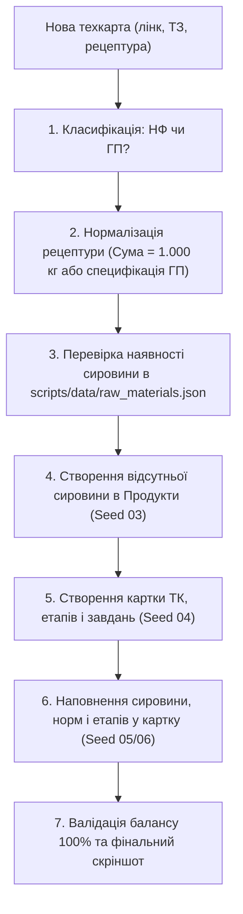

# ⚗️ Creatio Routing Expert Standard (Технологічні карти ТК-НФ та ТК-ГП)

Даний скіл описує повний регламент, архітектуру та автоматизований процес заведення нових **Технологічних карт (Routing Cards)** у системі Creatio (Freedom UI) для проектів Xlab.

---

## 🧭 1. Архітектурний Workflow при отриманні нової техкарти

Коли користувач надає нове посилання, документ або рецептуру нової техкарти:



---

## 🏷️ 2. Золотий стандарт класифікації та найменувань

| Критерій | Напівфабрикат (НФ — Синтез / Варка) | Готова продукція (ГП — Фасування / Пакування) |
| :--- | :--- | :--- |
| **Формат назви ТК** | `ТК-НФ \| Варка <назва напівфабрикату>` | `ТК-ГП \| <Назва продукту> <Об'єм>` |
| **Ліміт символів** | Строго **до 50 символів** у будь-якій назві картки, етапу чи завдання | Строго **до 50 символів** |
| **Категорія продукту** | `Напівфабрикат` | `Готовий продукт` |
| **Базова одиниця** | `кілограм` (`IsBase = true`) | `кілограм` (`IsBase = true`), `штук` як вторинна одиниця пакування |
| **Типові етапи** | `фаза А`, `фаза В`, `фаза С`, `фази D, E, F`, `завершення` | `Санітарна обробка та дезінфекція`, `Фасування у флакони <об'єм>`, `Етикетування з датером та пакування` |
| **Тип обладнання** | `Реактори` *(або порожньо для ручного передміксу)* | `Фасування`, `Маркування та пакування` / `Етикетування` |
| **Ігнорувати кількість** | **100% задач мають `TRUE`** *(фіксований час на варку всього реактора)* | **`FALSE`** для фасування/етикеток *(нормується на 1 шт)*<br>**`TRUE`** виключно для миття лінії (1 год). **ВКЯ НЕ додається!** |
| **Баланс рецептури** | $\sum \text{Норм сировини} = \mathbf{1.00000000\text{ кг}}$ (100% точність) | 1 флакон = маса НФ (кг) + пакувальні матеріали (по 1 шт) |
| **Вкладка «Вихід» реактора** | **ОБОВ'ЯЗКОВО**: прив'язка НФ у `GenEquipmentProducts` із виходом (кг/год) | Для реактора ГП **НЕ додається** (ГП виходить з фасування) |

---

### ⚗️ Правило прив'язки Напівфабрикатів (НФ) до Реакторів (Вкладка «Вихід»)
Коли створюється або налаштовується обладнання з типом **«Реактори»** (`GenEquipment`):
1. **Обов'язкова дія**: У деталь/вкладку **«Вихід»** (`GenEquipmentProducts`) необхідно додати всі напівфабрикати (**НФ**), які можуть синтезуватися у цьому реакторі.
2. **Чому це критично**: Двигун планування замовлень Creatio (APS / `Запланувати виробництво`) знаходить реактор для виконання етапу синтезу техкарти **виключно через перевірку наявності відповідного НФ у вкладці «Вихід» реактора**. Якщо зв'язок відсутній — реактор не призначиться в розклад автоматично.
3. **Розрахунок продуктивності (`GenOutput`)**:
   $$\text{GenOutput (кг/год)} = \frac{\text{Об'єм завантаження (кг)}}{\text{Час технологічного циклу (год)}}$$
   - Наприклад, для реактора YEX-1000L на 1000 кг:
     - При циклі 4.0 год: $\frac{1000}{4.0} = 250\text{ кг/год}$.
     - При циклі 3.5 год: $\frac{1000}{3.5} = 285.714\text{ кг/год}$.
4. ⚠️ **Суворе застереження**: У вкладку «Вихід» реактора **НІКОЛИ НЕ додається Готова продукція (ГП)** — реактор виробляє виключно рідку масу/напівфабрикат!


## 📂 3. Принцип Data-Driven Seeding (Розподіл коду та даних)

> [!IMPORTANT]
> **Суворе правило**: Для додавання чи зміни тестових даних **НІКОЛИ не редагувати TypeScript-код у `scripts/seeds/*.ts`**.  
> Всі параметри, рецептури та посилання вносяться **виключно через JSON-файли** у директорії `scripts/data/`.

### Відповідність файлів даних скриптам запуску:
1. `scripts/data/raw_materials.json` ➔ `scripts/seeds/03_create_raw_materials.ts`
2. `scripts/data/semi_finished_routings.json` ➔ `scripts/seeds/04_create_semi_finished_routings.ts`
3. `scripts/data/finished_routings.json` ➔ `scripts/seeds/04_create_finished_routings.ts`
4. `scripts/data/semi_finished_materials.json` ➔ `scripts/seeds/05_add_semi_finished_materials.ts`
5. `scripts/data/finished_materials.json` ➔ `scripts/seeds/06_add_finished_materials.ts`

---

## 🛠️ 4. Покроковий регламент виконання робіт (Step-by-Step Runbook)

### Крок 1. Аналіз вхідних даних нової техкарти
1. З'ясувати URL картки або цільовий сервер (`main` чи `main2`).
2. Розібрати рецептуру сировини: назви, коди (RM-xxx), норми витрат, технологічні етапи (фази).
3. Перевірити суму норм: для НФ вона повинна дорівнювати рівно `1.00000000` (при відхиленні нормалізувати залишок на основний розчинник — воду).

### Крок 2. Актуалізація `scripts/data/raw_materials.json`
Перевірити, чи всі позиції сировини присутні у файлі:
```json
{
  "code": "RM-058",
  "name": "Глюкотейн Clear (GlucoTain Clear) (Clariant)",
  "category": "Сировина",
  "unit": "кілограм",
  "batchControl": "FEFO",
  "shelfLifeDays": "730"
}
```
Якщо позиції відсутні в Creatio — запустити сид:
```bash
ENV=main npx playwright test scripts/seeds/03_create_raw_materials.ts --project=seeds
```

### Крок 3. Налаштування рецептури в `scripts/data/semi_finished_materials.json`
Вказати пряме посилання на нову картку техкарти `routingUrl` та список компонентів з прив'язкою до фаз:
```json
[
  {
    "productName": "НФ Назва напівфабрикату",
    "routingName": "ТК-НФ | Варка напівфабрикату",
    "routingUrl": "https://xlab-analyst-main.poligon.crmgenesis.com/0/Shell/#Card/GenProductionRouting_FormPage/edit/<GUID>",
    "materials": [
      {
        "materialName": "Вода деіонізована",
        "unit": "кілограм",
        "rate": "0.6645",
        "stageName": "фаза А"
      },
      {
        "materialName": "Spolapon AES 242/70",
        "unit": "кілограм",
        "rate": "0.1300",
        "stageName": "фаза В"
      }
    ]
  }
]
```

### Крок 4. Запуск наповнення сировини (Seed 05)
Запустити раннер наповнення у фоновому режимі:
```bash
ENV=main npx playwright test scripts/seeds/05_add_semi_finished_materials.ts --project=seeds
```
*(Або з прапором `--headed`, якщо користувач попросив: «запусти что бы я видел»).*

---

## 🛡️ 5. Специфіка автоматизації Creatio Freedom UI (Known Pitfalls)

Під час роботи з модальним вікном сировини `GenRawMaterials_ModalPage` діють наступні залізні правила:

1. **Баг одиниці виміру (`кілограм`)**:
   * При виборі сировини Creatio **автоматично встановлює** одиницю виміру `кілограм`.
   * **Заборонено клікати або переобирати одиницю**, якщо вона вже містить `кілограм`. Повторний клік викликає системний діалог «Додати одиницю виміру продукту», який блокує збереження.
2. **Нейтралізація Angular RouterLink**:
   * У випадаючих списках `mat-option` містяться посилання `<a>`, клік по яких спричиняє перехід браузера на картку товару `Products_FormPage`.
   * Перед вибором опції обов'язково використовувати `safeSelectOption`, що замінює `<a>` на нейтральний `<span>` або клікає по безпечній текстовій зоні.
3. **Селектор кнопки додавання в секції**:
   * Для уникнення `strict mode violation` використовувати однозначний локатор:
     `materialsSection.locator('[id^="GridDetailAddBtn_"] button, button[title="Новий"], button[aria-label="Новий"]').first()`
4. **Синхронізація модального вікна**:
   * Обов'язково очікувати повного закриття модалки: `await modal.waitFor({ state: 'detached', timeout: 15000 })`.
   * Робити паузу 1.5–2 секунди між записами для завершення оновлення реєстру Freedom UI.

---

## 📊 6. Регламент звітності та фіналізації

Після завершення прогону:
1. Зафіксувати фінальний скріншот заповненої таблиці у папці артефактів.
2. Вивести структуровану таблицю з усіма 19 (або N) позиціями, нормами та фазами.
3. Перевірити суму балансу (1.00000000 кг).
4. За правилом регламенту взаємодії повідомити користувача:
   > «Я пофіксив і заповнив усю сировину разом з етапами, перевір, будь ласка! 🚀»
