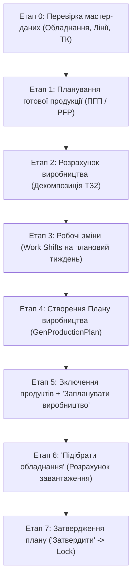

# 📋 Покроковий Чек-лист тестування алгоритмів блоку планування виробництва

> **Призначення:** Покрокова інструкція «Що за чим виконуємо» для тестувальника та автотестів згідно з бізнес-алгоритмами Creatio Xlab.

---

## 🧭 Загальна схема послідовності кроків

---

## 🛠️ ЕТАП 0. Перевірка мастер-даних (Pre-requisites)
> *Мета: Переконатися, що довідники та технологічні карти налаштовані коректно перед запуском планових алгоритмів.*

* [ ] **0.1. Обладнання для напівфабрикатів (Реактори):**
  * Статус: `В роботі`.
  * Заповнено: `Об'єм (для реактора)`.
  * Заповнено калібрувальні години під рівні завантаження **50% / 75% / 95%**.
  * Реактор прив'язаний до своєї виробничої лінії (**строго 1 реактор на лінію варки**).
* [ ] **0.2. Обладнання для готової продукції (Лінії розливу/пакування):**
  * Статус: `В роботі`.
  * Заповнено: `Продуктивність` та `Одиниця продуктивності`.
  * На лінії готової продукції **немає реакторів** (тільки автомати фасування, маркування, пакування).
* [ ] **0.3. Технологічні карти (ТК):**
  * Для кожного Готового Продукту (ГП) створено ТК з етапами `Фасування` та `Пакування` (**без варки**).
  * Для кожного Напівфабрикату (НФ) створено ТК з етапом `Варка` на реакторі з вказанням норми часу.
  * Усі ТК переведені в статус `Активна`.

---

## 📦 ЕТАП 1. Формування попиту — Планування готової продукції (ПГП / PFP)
> *Мета: Створити план потреби на місяць та перевести його в статус «Затверджено».*

* [ ] **1.1. Створення запису ПГП:**
  * Перейти в розділ **«Планування готової продукції»** (`GenPlanFinishProduct_ListPage`).
  * Натиснути `+ Додати`.
  * Вказати майбутній період: `Рік` (напр. *2026*), `Місяць` (напр. *Вересень*), `Бренд`.
  * Зберегти модальне вікно.
* [ ] **1.2. Додавання продуктів у деталь:**
  * У таблиці `План потреби готової продукції` додати рядок продукту.
  * Перевірити автоматичне підтягування `Технологічної карти` (або обрати зі списку).
  * Вказати `Замовлення` (кількість до виробництва) та `Мін залишок`.
* [ ] **1.3. Затвердження ПГП:**
  * Перевести запис по стадіях процесу: `Новий` ➔ `Відділ продажів` ➔ `Фінальне затвердження` ➔ **`Затверджено`**.
  * **Критерій успіху:** ПГП заблоковано для редагування, статус = `Затверджено`.
  * *(Негативна перевірка: якщо у продукту немає ТК — система видає помилку і не дає затвердити).*

---

## 🧮 ЕТАП 2. Зведення та декомпозиція — Розрахунок виробництва (`GenProductionCalculat`)
> *Мета: Перевірити автоматичне створення/оновлення зведеного розрахунку та 3-рівневу декомпозицію.*

* [ ] **2.1. Перевірка реєстру:**
  * Перейти в розділ **«Розрахунок виробництва»** (`GenProductionCalculat_ListPage`).
  * Знайти розрахунок на цільовий місяць (створюється автоматично при затвердженні ПГП/замовлень або вручну).
  * Статус: `Активний`.
* [ ] **2.2. Валідація вкладки «ПРОДУКТИ РОЗРАХУНКУ ВИРОБНИЦТВА»:**
  * Відкрити картку розрахунку.
  * Перевірити таблицю декомпозиції:
    * `Рівень 1` — Готовий продукт (ГП).
    * `Рівень 2` — Напівфабрикати (НФ).
    * `Рівень 3` — Сировина та пакувальні матеріали (ПЕТ флакони, кришки, етикетки, хімія, вода).
  * **Критерій успіху:** Дерево декомпозиції містить усі розраховані кількості компонентів.

---

## ⏰ ЕТАП 3. Виробничий календар — Робочі зміни (`Зміни` / `GenWorkShift`)
> *Мета: Забезпечити наявність доступного робочого часу для ліній та обладнання на плановий тиждень.*

* [ ] **3.1. Створення робочих змін:**
  * Перейти в розділ **«Зміни»** (`GenWorkShift_ListPage`).
  * Створити зміни на плановий тижневий період (наприклад, з `07.09.2026` по `13.09.2026`).
  * `Початок`: напр. `07.09.2026 08:00`, `Завершення`: `07.09.2026 20:00`.
  * `Тип робочої зміни`: **Виробнича**.
  * `Статус`: **Запланована** або **В процесі**.
  * Прив'язати зміну до виробничих ліній та обладнання.
  * **Критерій успіху:** Зміна збережена, обладнання має доступний плановий фонд робочого часу (40 год/тиждень).

---

## 🗓️ ЕТАП 4. Створення Плану виробництва (`GenProductionPlan`)
> *Мета: Створити щотижневий план виробництва з прив'язкою до розрахунку дефіциту.*

* [ ] **4.1. Створення картки плану:**
  * Перейти в розділ **«План виробництва»** (`GenProductionPlan_ListPage`).
  * Натиснути `+ Додати`.
  * Заповнити дати тижня:
    * `Дата початку (план)`: напр. `07.09.2026` (**не менше поточної дати!**).
    * `Дата завершення (план)`: напр. `13.09.2026`.
  * Обрати поле `Розрахунок виробництва` (напр. *3_140726* або створений на Етапі 2).
  * Натиснути `Зберегти`.
* [ ] **4.2. Обробка розрахунку дефіциту:**
  * Дочекатися спливаючого повідомлення: *«Розрахунок дефіциту успішно завершено»*.
  * Натиснути `OK`.
  * Відкрити створений План виробництва з першого рядка реєстру.
  * Якщо з'являється системне повідомлення щодо залишків товарів — закрити його кнопкою `OK`.
  * **Критерій успіху:** У картці плану на вкладці `ПРОДУКТИ ПЛАНУ ВИРОБНИЦТВА` з'явилися рядки з категоріями розподілу (`Доступні компоненти` / `Відсутні компоненти`).

---

## 🚀 ЕТАП 5. Формування замовлень — Алгоритм «Запланувати виробництво»
> *Мета: Вибрати номенклатуру та згенерувати виробничі замовлення під партії.*

* [ ] **5.1. Вибір продуктів для включення в план:**
  * На вкладці `ПРОДУКТИ ПЛАНУ ВИРОБНИЦТВА` встановити чекбокси **«Включити до плану»** для потрібних рядків.
* [ ] **5.2. Запуск алгоритму:**
  * Натиснути кнопку **«✓ Запланувати виробництво»** над таблицею продуктів.
  * Дочекатися завершення розрахунку.
* [ ] **5.3. Перевірка результатів:**
  * Перевірити ліву панель: заповнився відсоток завантаження в секції **«Завантаження обладнання»** (Змішувач, Реактор, Стерилізатор).
  * Перейти на вкладку **«ВИРОБНИЧІ ЗАМОВЛЕННЯ»**:
    * Сформувалися виробничі замовлення на Готовий продукт (ГП).
    * Сформувалися виробничі замовлення на Напівфабрикати (НФ).
  * **Критерій успіху:** Замовлення мають статус `Чернетка`, поле `Обладнання` поки що порожнє.

---

## ⚙️ ЕТАП 6. Автопідбір обладнання — Алгоритм «Підібрати обладнання»
> *Мета: Автоматично розрахувати тривалість, призначити реактори та лінії розливу за критерієм 80% завантаження.*

* [ ] **6.1. Запуск автопідбору:**
  * Знаходячись на вкладці `ВИРОБНИЧІ ЗАМОВЛЕННЯ`, натиснути кнопку **«✓ Підібрати обладнання»**.
  * Дочекатися виконання алгоритму розрахунку.
* [ ] **6.2. Валідація бізнес-правил підбору:**
  * Для завдань **варки НФ**: призначено відповідний Реактор; тривалість розрахована за формулою інтерполяції ВТВЗ (50/75/95%).
  * Для завдань **фасування/пакування ГП**: призначено автомати розливу/пакування; тривалість = $Об'єм / Продуктивність$.
  * Перевірити розрахунок дат:
    * `Start time` кожного наступного завдання = найпізніший `End time` попереднього завдання на цьому обладнанні.
    * `End time` = `Start time` + `Тривалість (хв)`.
  * Якщо завантаження одиниці обладнання > 80% (32 год/тиждень) — обробити модальне попередження *(«Обладнання вже завантажено більше ніж на 80%. Продовжити планування?»)*.
  * **Критерій успіху:** У кожному виробничому завданні заповнені поля `Обладнання`, `Тривалість (план, хв)`, `Start time` та `End time`.

---

## 🔒 ЕТАП 7. Фіналізація та затвердження Плану
> *Мета: Зафіксувати тижневий виробничий план та перевести в захищений режим.*

* [ ] **7.1. Затвердження:**
  * У правому верхньому куті картки натиснути кнопку **«Затвердити»**.
* [ ] **7.2. Перевірка блокування:**
  * Статус плану перейшов у **«Затверджено»**.
  * З'явилася іконка замка 🔒 (редагування заблоковано).
  * Виробничі замовлення передані на виконання цеху.
  * **Критерій успіху:** Наскрізний цикл (Happy Pass) успішно завершено!

---

## 📊 Матриця відстеження проходження чек-листа

| Етап | Назва етапу | Відповідальний автотест / Специфікація | Статус |
| :---: | :--- | :--- | :---: |
| **0** | Перевірка мастер-даних | `equipmentCreation.spec.ts`, `scripts/seeds/genProductionRoutingData.ts` | 🟢 Готово |
| **1** | Планування готової продукції (ПГП) | `genPlanFinishProductCreation.spec.ts` | 🟢 Пройдено |
| **2** | Розрахунок виробництва (Декомпозиція) | `productionCalculationDecomposition.spec.ts` | 🟢 Пройдено |
| **3** | Робочі зміни (Work Shifts) | `workShiftCreation.spec.ts` | 🟢 Пройдено |
| **4** | Створення Плану виробництва | `TC-PLAN-04` (Тест 1) | 🟡 Налаштування |
| **5** | Алгоритм «Запланувати виробництво» | `TC-PLAN-04` (Тест 2, 3) | 🟡 Налаштування |
| **6** | Алгоритм «Підібрати обладнання» | `TC-PLAN-05` (Тест 4) | 🟡 Налаштування |
| **7** | Затвердження Плану виробництва | `TC-PLAN-06` (Фінал) | 🟡 Налаштування |
