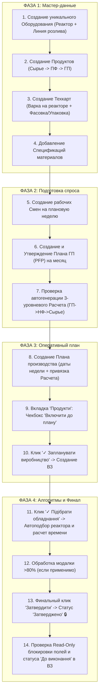

# 🏗️ Архитектурный план: Сверхстабильный сквозной E2E автотест (Full Production Lifecycle)

## 📌 Цель документа
Спецификация и архитектурный регламент для реализации 100% детерминированного, сверхстабильного и изолированного сквозного E2E автотеста (`fullE2EProductionChain.spec.ts`), охватывающего **полный жизненный цикл производства в Creatio от А до Я**.

---

## 🛡️ 6 Столпов стабильности (Stability Pillars)

Чтобы E2E тест никогда не ломался при ежедневных прогонах и после переноса пакетов, в нем реализуются 6 ключевых правил:

1. **Изоляция данных через `Run ID` (Zero Collisions):**
   * Каждый запуск теста генерирует уникальный суффикс `_E2E_${Date.now().toString().slice(-5)}`.
   * Все создаваемые сущности (`Реактор_12345`, `Шампунь_12345`, `ТК_12345`, `План_12345`) уникальны, не конфликтуют с существующими записями и защищены от изменений в БД другими пользователями.
2. **Ликвидация «слепых» `waitForTimeout`:**
   * Замена любых жестких пауз на смарт-ожидания масок загрузки Creatio (`.crt-loading-mask`, `mat-spinner`, `crt-mask`, `.mat-mdc-progress-spinner` ➔ `state: 'hidden'`).
3. **Запрет «тихих пропусков» (`if (isVisible)`):**
   * Все обязательные поля и кнопки ожидаются через строгие Web-First Assertions (`await locator.waitFor({ state: 'visible', timeout: 20000 })`). Тест не имеет права тихо пропустить незаполненное поле.
4. **Устойчивая работа с Angular CDK Combobox (Smart Fallback):**
   * Протокол работы: Клик по полю ➔ Ожидание открытия `.cdk-overlay-pane` ➔ Ввод поисковой строки ➔ Ожидание исчезновения спиннера фильтрации ➔ Клик по точной опции `mat-option` (с проверкой синонимов при рассинхроне пакетов).
5. **Динамический расчет дат:**
   * Тест автоматически вычисляет даты предстоящего понедельника и воскресенья относительно текущей даты запуска, исключая хардкод месяцев.
6. **Фотофиксация каждого шага:**
   * Скриншоты ключевых контрольных точек автоматически сохраняются и передаются в интерактивный дашборд `custom_report.html`.

---

## 🔄 Сквозной бизнес-маршрут (14 Контрольных точек)

---

## 📋 Пошаговый регламент выполнения

### ФАЗА 1: Создание изолированных мастер-данных
1. **[Checkpoint 1] Создание Оборудования:**
   * Создание Реактора с объемом 1000 кг и калибровочными точками 50% (2.0 ч), 75% (3.0 ч), 95% (4.0 ч).
   * Создание Фасовочно-паковочного автомата с производительностью 1200 шт/час.
2. **[Checkpoint 2] Создание Продуктов:**
   * Сырье: Флакон 250 мл, Крышка, Вода, ПАВ.
   * Полуфабрикат (НФ): Основа шампуня восстанавливающего (FEFO, 730 дней).
   * Готовый продукт (ГП): Шампунь Восстанавливающий 250 мл.
3. **[Checkpoint 3] Создание Технологических карт:**
   * ТК для НФ: этап «Варка» на Реакторе.
   * ТК для ГП: этапы «Фасовка» и «Упаковка» на линии розлива.
4. **[Checkpoint 4] Спецификации материалов:**
   * Привязка норм расхода компонентов в ТК.

---

### ФАЗА 2: Подготовка спроса и декомпозиция
5. **[Checkpoint 5] Создание Рабочих смен:**
   * Формирование производственных смен на целевую неделю плана (`08:00 - 20:00`).
6. **[Checkpoint 6] План готовой продукции (ПГП):**
   * Создание записи на целевой месяц с количеством `10 000` шт.
   * Нажатие стадии DCM / кнопки «Затвердити» (🔒 статус `Затверджено`).
7. **[Checkpoint 7] Проверка Расчета производства (`GenProductionCalculat`):**
   * Валидация автоматической генерации 3-уровневого дерева декомпозиции (ГП ➔ НФ ➔ Сырье).

---

### ФАЗА 3: Оперативное планирование производства
8. **[Checkpoint 8] Создание Плана производства (`GenProductionPlan`):**
   * Заполнение дат плановой недели (понедельник – воскресенье).
   * Привязка активного Расчета производства.
   * Нажатие кнопки «Зберегти».
9. **[Checkpoint 9] Расчет дефицита:**
   * Переход на вкладку «ПРОДУКТИ ПЛАНУ ВИРОБНИЦТВА».
   * Установка чекбокса «Включити до плану» для целевого ГП.
10. **[Checkpoint 10] Алгоритм «Запланувати виробництво»:**
    * Клик по кнопке «✓ Запланувати виробництво».
    * Проверка создания строк Производственных заказов (ВЗ) в статусе `Чернетка`.

---

### ФАЗА 4: Алгоритм подбора оборудования и Затвердження
11. **[Checkpoint 11] Алгоритм «Підібрати обладнання»:**
    * Переход на вкладку «ВИРОБНИЧІ ЗАМОВЛЕННЯ».
    * Клик по кнопке «✓ Підібрати обладнання».
    * Проверка автоматического подбора Реактора и Линии розлива, расчет времени старта и финиша.
12. **[Checkpoint 12] Обработка модального предупреждения:**
    * Если загрузка превышает 80% — автоматическое подтверждение «Так / Продовжити».
13. **[Checkpoint 13] Финальное утверждение Плана:**
    * В шапке формы нажать кнопку «Затвердити».
    * Проверка перехода статуса Плана в **`Затверджено`**.
14. **[Checkpoint 14] Валидация защиты и нарядов цеха:**
    * Проверка перехода всех полей шапки в режим **Read-Only (🔒)**.
    * Проверка перехода связанных заказов в статус **`До виконання`**.

---

## 🧪 Критерии успешности (Quality Gate / Definition of Done)
* ✅ Тест выполняется полностью автономно за время $\le 5$ минут.
* ✅ Отсутствие жестких привязок к чужим записям или статическим датам.
* ✅ Все 14 контрольных точек снабжены скриншотами в `custom_report.html`.
