# 🏗️ Генеральний план створення тестового датасету: Продукти, Сировина, Техкарти та BOM-ланцюжки (APS Creatio)

> **Призначення документа**: Повний покроковий план створення та сидингу тестових даних для вичерпного тестування трьох модулів алгоритму планування APS (Order Chain Builder, Queue Builder, Gantt Scheduling).  
> **Цільове середовище**: Новий або оновлений стенд (`main2` / `xlab-analyst-main2` або окремий стенд).  
> **Ізоляція даних**: Усі сутності створюються з унікальним префіксом `[XTEST]` та кодами `XT-*`, що гарантує 100% збереження існуючих демо-даних.  
> **Стандарт якості**: BMAD / Creatio Routing Expert.

---

## 📊 1. Зведений скоуп сутностей

| Категорія сутностей | Кількість | Призначення у тестуванні алгоритму |
| :--- | :---: | :--- |
| **Сировина (хімічна)** | **18** | Базові хімічні компоненти для варіння НФ у реакторах (кг, FEFO). |
| **Пакувальні матеріали** | **7** | Флакони, помпи, кришки, етикетки, гофрокороби для фасування ГП (шт). |
| **Напівфабрикати (НФ)** | **18** | Маси різних рівнів вкладеності (Рівень 0..3) з прив'язкою у «Вихід» реакторів. |
| **Готова продукція (ГП)** | **12** | Товарні флакони/туби з різною структурою BOM (0..3 НФ, 1..4 рівні). |
| **Техкарти НФ (ТК-НФ)** | **18** | 3 етапи, 3 завдання на «Реактори», `Ігнорувати кількість = TRUE`. |
| **Техкарти ГП (ТК-ГП)** | **12** | 3 етапи, 4 завдання (розлив/етикетування/пакування), **СТРОГО БЕЗ ВКЯ**. |
| **BOM-зв'язки з прапорцями** | **Всі ТК** | Варіації прапорця `Планувати разом` (жорсткий зв'язок) та правила агрегації. |

---

## 🧪 2. Каталог Сировини та Пакувальних матеріалів (Створення на новому стенді)

Оскільки на новому стенді сировина та тара можуть бути відсутні, створюється повноцінний каталог компонентів у розділі `Продукти`:

### А. Хімічна сировина (`Категорія = Сировина`, Базова од. = `кілограм`, партійний облік = `FEFO`, термін = 730 дн.)
| Код | Назва сировини | Роль у технології |
| :--- | :--- | :--- |
| `XT-RM-001` | `[XTEST] Вода деіонізована` | Основний розчинник для водної фази |
| `XT-RM-002` | `[XTEST] Spolapon AES 242/70 (SLES)` | Основна аніонна ПАР для піноутворення |
| `XT-RM-003` | `[XTEST] Mackam CAB 818 (CAPB)` | М'яка амфотерна ко-ПАР |
| `XT-RM-004` | `[XTEST] Plantapon SF` | Безсульфатна миюча база |
| `XT-RM-005` | `[XTEST] Сіль екстра (NaCl)` | Регулятор в'язкості |
| `XT-RM-006` | `[XTEST] Д-Пантенол 75%` | Зволожуючий активний компонент |
| `XT-RM-007` | `[XTEST] Гідролізат протеїнів шовку` | Зміцнюючий протеїновий комплекс |
| `XT-RM-008` | `[XTEST] Гідролізат протеїнів кератину` | Відновлюючий протеїновий комплекс |
| `XT-RM-009` | `[XTEST] Комплекс вітамінів A, E, C, B5` | Антиоксидантний комплекс |
| `XT-RM-010` | `[XTEST] Екстракт ромашки CO2` | Рослинний заспокійливий екстракт |
| `XT-RM-011` | `[XTEST] Олія макадамії водорозчинна` | Ліпідний живильний компонент |
| `XT-RM-012` | `[XTEST] Олія аргани рафінована` | Живильна ліпідна олія |
| `XT-RM-013` | `[XTEST] Консервант Nipaguard PE 9010` | Захист від мікробіології |
| `XT-RM-014` | `[XTEST] Віддушка Mango & Camellia` | Ароматична композиція |
| `XT-RM-015` | `[XTEST] Віддушка Green Tea & Aloe` | Ароматична композиція |
| `XT-RM-016` | `[XTEST] Лимонна кислота 20% розчин` | Регулятор рівня pH |
| `XT-RM-017` | `[XTEST] Трилон Б (Динатрій ЕДТА)` | Хелатуючий агент |
| `XT-RM-018` | `[XTEST] Гліцерин дистильований 99.5%` | Зволожувач |

### Б. Пакувальні матеріали (`Категорія = Матеріали`, Базова од. = `штук`, облік = `FEFO`)
| Код | Назва тари / пакування | Норма на 1 шт ГП |
| :--- | :--- | :---: |
| `XT-PM-001` | `[XTEST] Флакон ПЕТ 250 мл прозорий` | 1 шт |
| `XT-PM-002` | `[XTEST] Флакон ПЕТ 400 мл бурштин` | 1 шт |
| `XT-PM-003` | `[XTEST] Флакон-спрей ПЕТ 150 мл білий` | 1 шт |
| `XT-PM-004` | `[XTEST] Кришка диск-топ 24/410 біла` | 1 шт |
| `XT-PM-005` | `[XTEST] Дозатор нажимний 24/410 помпа` | 1 шт |
| `XT-PM-006` | `[XTEST] Етикетка самоклейна лицьова/контр` | 1 шт |
| `XT-PM-007` | `[XTEST] Гофроящик чотирьохклапанний` | 0.05 шт (1 на 20 флаконів) |

---

## 🌳 3. Архітектура BOM-дерева: Рівні вкладеності (1–4) та Розгалуження (1–3 НФ)

```mermaid
graph TD
    subgraph "Кейс 1: Рівень 1 (Без НФ)"
        GP1["XT-GP-001 Міцелярна вода"] --> RM_M1["XT-RM-001 Вода + Активи + Тара"]
    end

    subgraph "Кейс 2: Рівень 2 (1 НФ - 1 гілка)"
        GP2["XT-GP-002 Тонік Herbal"] -->|dashed: гнучкий| NF14["XT-NF-014 Маса тоніка"]
        GP3["XT-GP-003 Шампунь Daily"] -->|solid: жорсткий| NF09["XT-NF-009 Маса шампуню"]
    end

    subgraph "Кейс 3: Рівень 2 (2 гілки НФ)"
        GP5["XT-GP-005 Шампунь DuoActive"] -->|solid: 0.4кг| NF02["XT-NF-002 ПАВ-основа"]
        GP5 -->|dashed: 0.6кг| NF05["XT-NF-005 Вітамін-премікс"]
    end

    subgraph "Кейс 4: Рівень 2 (3 гілки НФ)"
        GP7["XT-GP-007 Кондиціонер TrioPower"] -->|solid: 0.6кг| NF03["XT-NF-003 Емульс-база"]
        GP7 -->|solid: 0.25кг| NF04["XT-NF-004 Масляна фаза"]
        GP7 -->|dashed: 0.15кг| NF05_B["XT-NF-005 Вітамін-премікс"]
    end

    subgraph "Кейс 5: Рівні 3 та 4 (Глибока вкладеність)"
        GP9["XT-GP-009 Шампунь 3-рівні"] -->|Рівень 2| NF10["XT-NF-010 Маса відновлююча"]
        NF10 -->|Рівень 1| NF06["XT-NF-006 Протеїн-комплекс"]
        NF06 -->|Рівень 0| RM_K["XT-RM-008 Кератин"]

        GP10["XT-GP-010 Еліксир 4-рівні"] -->|Рівень 3| NF15["XT-NF-015 Преміум-маса"]
        NF15 -->|Рівень 2| NF18["XT-NF-018 Нано-вітаміни"]
        NF18 -->|Рівень 1| NF05_C["XT-NF-005 Вітамін-премікс"]
        NF05_C -->|Рівень 0| RM_V["XT-RM-009 Вітаміни"]
    end

    subgraph "Кейс 6: Агрегація та поширення жорсткого зв'язку"
        GP11["XT-GP-011 Шампунь-А"] -->|solid: жорсткий| NF17["XT-NF-017 Універсальний Агрегат"]
        GP12["XT-GP-012 Гель-Б"] -->|dashed: гнучкий| NF17
    end
```



---

## 📋 4. Детальний реєстр Напівфабрикатів (НФ) — 18 позицій

Всі НФ мають базову одиницю **кілограм** (`IsBase = true`).  
⚠️ **Обов'язкова умова**: кожен створений НФ додається у вкладку **«Вихід»** (`GenEquipmentProducts`) обладнання типу `Реактори`.

| Код | Назва Напівфабрикату | Рівень | ТК варіння | Обладнання | Час циклу |
| :--- | :--- | :---: | :--- | :--- | :---: |
| `XT-NF-001` | `[XTEST] НФ Водна фаза підготовлена` | 0 | `ТК-НФ \| Водна фаза` | Реактори | 1.5 год |
| `XT-NF-002` | `[XTEST] НФ ПАВ-основа шампуню` | 0 | `ТК-НФ \| ПАВ-основа` | Реактори | 2.5 год |
| `XT-NF-003` | `[XTEST] НФ Емульсійна база кондиціонера` | 0 | `ТК-НФ \| Емульсійна база` | Реактори | 3.0 год |
| `XT-NF-004` | `[XTEST] НФ Масляна фаза емульгуюча` | 0 | `ТК-НФ \| Масляна фаза` | Реактори | 1.5 год |
| `XT-NF-005` | `[XTEST] НФ Вітамінно-активний премікс` | 0 | `ТК-НФ \| Вітамінний премікс` | Реактори | 1.0 год |
| `XT-NF-006` | `[XTEST] НФ Відновлюючий комплекс протеїнів`| 0 | `ТК-НФ \| Протеїновий комплекс`| Реактори | 1.5 год |
| `XT-NF-007` | `[XTEST] НФ Рослинний екстракт концентрат` | 0 | `ТК-НФ \| Рослинний екстракт` | Реактори | 1.0 год |
| `XT-NF-008` | `[XTEST] НФ Базовий міцелярний розчин` | 0 | `ТК-НФ \| Міцелярний розчин` | Реактори | 1.5 год |
| `XT-NF-009` | `[XTEST] НФ Маса шампуню зволожуючого` | 1 | `ТК-НФ \| Маса зволожуюча` | Реактори | 3.5 год |
| `XT-NF-010` | `[XTEST] НФ Маса шампуню відновлюючого` | 1 | `ТК-НФ \| Маса відновлююча` | Реактори | 4.0 год |
| `XT-NF-011` | `[XTEST] НФ Маса бальзаму живильного` | 1 | `ТК-НФ \| Маса бальзаму` | Реактори | 3.5 год |
| `XT-NF-012` | `[XTEST] НФ Маса кондиціонера протеїнова` | 1 | `ТК-НФ \| Маса кондиціонера` | Реактори | 3.5 год |
| `XT-NF-013` | `[XTEST] НФ Маса гелю для душу AquaFresh` | 1 | `ТК-НФ \| Маса гелю AquaFresh`| Реактори | 3.0 год |
| `XT-NF-014` | `[XTEST] НФ Маса тоніка заспокійливого` | 1 | `ТК-НФ \| Маса тоніка` | Реактори | 2.0 год |
| `XT-NF-015` | `[XTEST] НФ Комплексна маса преміум` | 2 | `ТК-НФ \| Комплексна маса` | Реактори | 4.0 год |
| `XT-NF-016` | `[XTEST] НФ Маса маски глибокого відновл.` | 2 | `ТК-НФ \| Маса маски` | Реактори | 4.0 год |
| `XT-NF-017` | `[XTEST] НФ Універсальна основа (Агрегат)` | 0 | `ТК-НФ \| Універсальна основа`| Реактори | 3.0 год |
| `XT-NF-018` | `[XTEST] НФ Премікс нано-вітамінів` | 1 | `ТК-НФ \| Нано-вітаміни` | Реактори | 1.5 год |

---

## 📦 5. Детальний реєстр Готової продукції (ГП) — 12 позицій

Базова одиниця: **кілограм** (`IsBase = true`), вторинна: **штук** (`NumberOfBaseUnits`).

| Код | Назва Готового Продукту | Об'єм/Вага | Кількість шт/кг | Склад по НФ | Тестовий сценарій |
| :--- | :--- | :---: | :---: | :--- | :--- |
| `XT-GP-001` | `[XTEST] ГП Міцелярна вода Pure Clean` | 150 мл | 6.667 шт/кг | **0 НФ** (тільки сировина) | Базовий плоский BOM |
| `XT-GP-002` | `[XTEST] ГП Тонік для обличчя Herbal` | 150 мл | 6.667 шт/кг | 1 НФ (`XT-NF-014`) | 1 НФ, **гнучкий зв'язок** (пунктир) |
| `XT-GP-003` | `[XTEST] ГП Шампунь базовий Daily` | 250 мл | 4.000 шт/кг | 1 НФ (`XT-NF-009`) | 1 НФ, **жорсткий зв'язок** (суцільна) |
| `XT-GP-004` | `[XTEST] ГП Бальзам для волосся Silk` | 250 мл | 4.000 шт/кг | 1 НФ (`XT-NF-011`) | 1 НФ, жорсткий зв'язок |
| `XT-GP-005` | `[XTEST] ГП Шампунь DuoActive 250мл` | 250 мл | 4.000 шт/кг | 2 НФ (`XT-NF-002` + `XT-NF-005`) | **2 гілки**: 1 жорсткий + 1 гнучкий |
| `XT-GP-006` | `[XTEST] ГП Гель AquaFresh 400мл` | 400 мл | 2.500 шт/кг | 2 НФ (`XT-NF-002` + `XT-NF-001`) | **2 гілки**: обидва гнучкі зв'язки |
| `XT-GP-007` | `[XTEST] ГП Кондиціонер TrioPower 250мл` | 250 мл | 4.000 шт/кг | 3 НФ (`XT-NF-003`+`004`+`005`) | **3 гілки**: 2 жорсткі + 1 гнучкий |
| `XT-GP-008` | `[XTEST] ГП Крем-мило TripleCare 400мл` | 400 мл | 2.500 шт/кг | 3 НФ (`XT-NF-002`+`004`+`006`) | **3 гілки**: всі 3 жорсткі зв'язки |
| `XT-GP-009` | `[XTEST] ГП Шампунь відновл. 3-рівні` | 250 мл | 4.000 шт/кг | ГП ➔ `XT-NF-010` ➔ `XT-NF-006` | **3 рівні глибини BOM** |
| `XT-GP-010` | `[XTEST] ГП Еліксир преміум 4-рівні` | 150 мл | 6.667 шт/кг | ГП ➔ `015` ➔ `018` ➔ `005` | **4 рівні глибини BOM** |
| `XT-GP-011` | `[XTEST] ГП Шампунь Агрегат-А 250мл` | 250 мл | 4.000 шт/кг | `XT-NF-017` (Спільний) | **Агрегація: жорсткий прапорець (TRUE)** |
| `XT-GP-012` | `[XTEST] ГП Гель Агрегат-Б 400мл` | 400 мл | 2.500 шт/кг | `XT-NF-017` (Спільний) | **Агрегація: гнучкий прапорець (FALSE)** |

---

## ⚙️ 6. Матриця перевірки прапорця «Планувати разом» (Hard vs Flexible Links)

| Сценарій тестування | Конфігурація прапорця у ТК | Очікувана лінія у Ганті / Білдері | Очікувана поведінка при перетягуванні блоку |
| :--- | :--- | :--- | :--- |
| **Чистий гнучкий зв'язок** | `isHardLink = false` | **Пунктирна (dashed)** | Замовлення можна вільно рухати окремо в межах робочих змін. |
| **Чистий жорсткий зв'язок** | `isHardLink = true` | **Суцільна (solid)** | Замовлення блокуються в єдиний моноліт і зсуваються строго разом. |
| **Змішані гілки в одному ГП** | Гілка 1: `true`, Гілка 2: `false` | Гілка 1 — **суцільна**, Гілка 2 — **пунктирна** | Гілка 1 переміщується з ГП, Гілка 2 залишається на місці. |
| **Об'єднання замовлень (Агрегація)** | ГП-11: `true` + ГП-12: `false` | **Суцільна (solid) для ВСІЄЇ гілки!** | **Правило диз'юнкції**: наявність прапорця хоча б в одного замовлення перетворює весь агрегований ланцюг на жорсткий! |

---

## 🛠️ 7. Покроковий план виконання сидингу через Playwright

Запуск виконується строго через послідовні скрипти `scripts/seeds/`:

```bash
# Крок 0. Перевірка / перемикання оточення у .env або src/config/environment.ts (наприклад, стенд main2)
# Крок 1. Створення обладнання (реактори, лінії розливу, лінії етикетування)
npx playwright test scripts/seeds/00_create_equipment.ts

# Крок 2. Створення повного каталогу хімічної сировини та пакування (25 позицій)
npx playwright test scripts/seeds/03_create_raw_materials.ts

# Крок 3. Створення напівфабрикатів (18 НФ) + авто-прив'язка у деталь «Вихід» реакторів
npx playwright test scripts/seeds/01_create_semi_finished_products.ts

# Крок 4. Створення готової продукції (12 ГП) з одиницями кг та шт
npx playwright test scripts/seeds/02_create_finished_products.ts

# Крок 5. Створення технологічних карт для НФ (18 ТК-НФ з 3 етапами та реакторами)
npx playwright test scripts/seeds/03_create_semi_finished_routings.ts

# Крок 6. Створення технологічних карт для ГП (12 ТК-ГП з 3 етапами та лініями, БЕЗ ВКЯ)
npx playwright test scripts/seeds/04_create_finished_routings.ts

# Крок 7. Наповнення специфікацій сировини для НФ (рознесення по фазах А, Б, В)
npx playwright test scripts/seeds/05_add_semi_finished_materials.ts

# Крок 8. Наповнення специфікацій для ГП (сировина, тара, НФ з прапорцями зв'язків)
npx playwright test scripts/seeds/06_add_finished_materials.ts
```

---

## 🔍 8. Верифікація результатів та Acceptance Checklist

Після завершення сидингу виконується автоматизована та візуальна перевірка:

- [ ] **Check 1: Каталог сировини та тари**: У розділі `Продукти` наявні всі 25 створених компонентів із коректними категоріями (`Сировина` / `Матеріали`).
- [ ] **Check 2: Базові одиниці виміру**: Для всіх 18 НФ та 12 ГП базовою одиницею є **`кілограм`** (`IsBase = true`).
- [ ] **Check 3: Вкладка «Вихід» реакторів**: Усі 18 НФ прив'язані до обладнання типу `Реактори` з розрахованою продуктивністю (кг/год). ГП у вкладку «Вихід» не додано.
- [ ] **Check 4: Структура ТК-ГП**: Усі 12 карт для ГП мають 3 етапи, 4 завдання та **НЕ містять ВКЯ**.
- [ ] **Check 5: Структура ТК-НФ**: Усі 18 карт для НФ мають завдання на реактори зі встановленим прапорцем **`Ігнорувати кількість = TRUE`**.
- [ ] **Check 6: Генерація ланцюжка замовлень**: У плані виробництва при натисканні «Створити ланцюжок» у довіднику `Знімок ланцюга виконання замовлень` з'являється валідний JSON.
- [ ] **Check 7: Візуалізація графа**: JSON завантажується в утиліту `https://cjmean4ik.github.io/order-chain-builder/` і коректно відображає:
  - Компоненти 1..4 рівнів вкладеності.
  - Розгалуження на 1, 2 та 3 НФ.
  - Суцільні зв'язки для жорстких та пунктирні для гнучких.
- [ ] **Check 8: Перевірка агрегації**: При об'єднанні замовлень `XT-GP-011` та `XT-GP-012` спільне замовлення на `XT-NF-017` стає суцільним (жорстким) для всієї гілки.
