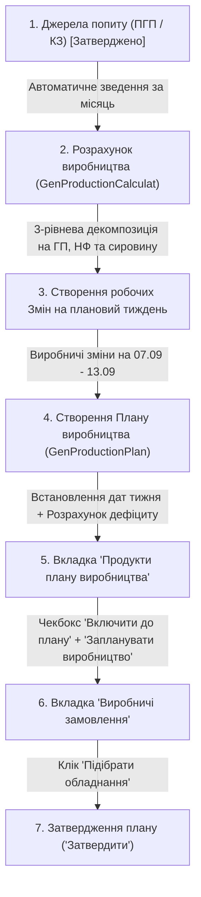

# 📋 Тестова специфікація: Алгоритми блоку планування виробництва (Test Plan & Pre-requisites)

> **Джерела вимог:**
> 1. Зустріч з бізнес-аналітиком Ганною Добряк: відео-інструкція `Алгоритми_блоку_планування_як_перевіряти.mp4` (41 хв).
> 2. Офіційна специфікація: документ `Алгоритми планування виробництва.docx`.
> 
> **Мета:** Повний скрізний позитивний прогін (Happy Pass) та специфікація алгоритмів блоку планування виробництва в системі Creatio Xlab.

---

## 📌 1. Чек-лист підготовки та попередніх тестів (Pre-requisites Checklist)

Для коректного запуску алгоритмів `Запланувати виробництво` та `Підібрати обладнання` у системі мають бути гарантовано налаштовані наступні сутності:

### 1.1. ⚙️ Довідник обладнання та Ліній (`GenEquipment` / `GenProductionLine`)
* [ ] **Реактори для напівфабрикатів (НФ):**
  * Статус: `В роботі`
  * Тип: `Реактор`
  * Заповнено поле **«Об'єм (для реактора)»** (`GenLoadingCapacity`)
  * Заповнено калібрувальні показники часу під завантаження **50% / 75% / 95%** (необхідні для роботи формули інтерполяції ВТВЗ).
  * Реактор прив'язаний до своєї **Лінії напівфабрикатів** (*Лінія 1*, *Линия 2*, *Линия 3* — **строго 1 реактор на лінію**).
* [ ] **Обладнання розливу/пакування для готової продукції (ГП):**
  * Статус: `В роботі`
  * Тип: `Фасувальний автомат` / `Пакувальний автомат` / `Етикетирувальник`
  * Заповнено поле **«Продуктивність»** (`GenProductivity`) та **«Одиниця продуктивності»**.
  * Прив'язані до **Лінії готової продукції** (*Лінія розливу*, *Лінія продуктів* — **строго без реакторів**).

### 1.2. 🧪 Продукти та Технологічні карти (`Product` / `GenProductionRouting`)
* [ ] **Готовий продукт (ГП):**
  * Категорія: `Готовий продукт` (наприклад, *Шампунь*, *Кондиціонер*, *Тонік*).
  * Прив'язана **Технологічна карта ГП** у статусі `Активна`.
  * Етапи техкарти ГП: строго **«Фасування»** та **«Пакування»** (без етапу варки).
* [ ] **Напівфабрикат (НФ):**
  * Категорія: `Напівфабрикат` (наприклад, *Основа кондиціонера*, *ПАВ-основа*).
  * Прив'язана **Технологічна карта НФ** у статусі `Активна`.
  * Етап техкарти НФ: містить етап **«Варка»** на реакторі з нормою часу на 1 умовну одиницю.
* [ ] **Сировина та пакувальні матеріали (Raw Materials):**
  * ПЕТ флакони, кришки-дозатори, етикетки, хімічні компоненти, вода — занесені у специфікацію сировини техкарт.

### 1.3. ⏰ Робочі зміни (`Зміни` / `GenWorkShift`)
* [ ] **Робочі зміни на цільовий тиждень планування:**
  * Створені зміни на плановий період (наприклад, щодня з `07.09.2026 08:00` по `07.09.2026 20:00`).
  * `Тип робочої зміни`: **Виробнича**.
  * `Статус`: **Запланована** або **В процесі**.
  * Прив'язані до відповідних виробничих ліній та обладнання.

### 1.4. 📅 Планування готової продукції (ПГП / PFP) — *TC-PLAN-01*
* [ ] **Створений та затверджений план ПГП:**
  * Рік: `2026`, Місяць: цільовий майбутній місяць (наприклад, `Вересень`).
  * Додано рядки продуктів із прив'язаними техкартами та кількістю.
  * Статус переведено на фінальну стадію: **«Затверджено»**.

### 1.5. 🧮 Розрахунок виробництва (`GenProductionCalculat`) — *TC-PLAN-02*
* [ ] **Створений та активний розрахунок:**
  * Статус: `Активний`.
  * Період дії охоплює плановий місяць.
  * На вкладці «ПРОДУКТИ РОЗРАХУНКУ ВИРОБНИЦТВА» згенеровано дерево 3-рівневої декомпозиції (ГП ➔ НФ ➔ Сировина/Упаковка).

---

## 🔄 2. Скрізний ланцюжок Happy Pass (Step-by-Step)

---

## 🧠 3. Математика та бізнес-правила алгоритмів (з офіційного ТЗ)

### А. Алгоритм підбору обладнання (`Підібрати обладнання`)
1. **Точка входу:** Натискання кнопки «Підібрати обладнання» на вкладці «Виробничі замовлення» на сторінці Плану виробництва.
2. **Відбір завдань:** 
   * `План виробництва ID` = ID поточного плану.
   * `Статус виробничого замовлення` = `Чернетка`.
   * Поле `Обладнання` у виробничому завданні не заповнено.
3. **Добір обладнання за типом:**
   * Тип обладнання збігається з типом у техкарті завдання.
   * Статус одиниці обладнання = `В роботі`.
4. **Підбір оптимальної одиниці за % завантаження (найближче до 80%):**
   * **Для реактора:** 
     $$\% \text{ завантаження} = \frac{\text{Об'єм з ВЗ (GenPlannedQuantity)}}{\text{Об'єм реактора (GenLoadingCapacity)}} \times 100$$
   * **Для іншого обладнання:** 
     $$\% \text{ завантаження} = \frac{\text{Кількість з ВЗ (GenPlannedQuantity)}}{\text{Продуктивність обладнання (GenProductivity)}} \times 100$$
5. **Розрахунок `Start time` та `End time`:**
   * У поточному періоді плану система шукає всі завдання на обраному обладнанні та зчитує їхній `End time`. Найпізніше значення стає `Start time` для наступного завдання.
   * $\text{End time} = \text{Start time} + \text{Тривалість (хв)}$.
6. **Розрахунок доступності (ліміт 32 год/тиждень):**
   * Доступний час роботи = $40 \text{ год} \times 0.8 = 32 \text{ години на тиждень}$.
   * Якщо загальний час перевищує доступний ліміт 80%, система виводить модальне попередження:
     > *«Обладнання [назва] вже завантажено більше ніж на 80%. Продовжити планування? (ТАК / НІ)»*

---

### Б. Алгоритм визначення тривалості виробничого замовлення (ВТВЗ — Три значення)
* **Загальне правило щодо типів:**
  * **Готова продукція (ГП):** Не може містити етап варки. Тільки «Фасування» та «Пакування».
  * **Напівфабрикати (НФ):** Можуть містити будь-які етапи, включаючи «Варку» на реакторі.
* **Формули розрахунку тривалості для НФ:**
  1. **Значення 1 (Норма часу):**
     $$\text{Значення 1} = \text{Обсяг виробництва} \times \text{Норма часу на 1 умовну од. з типового завдання}$$
  2. **Значення 2 (Інтерполяція продуктивності реактора):**
     Зчитуються показники часу під завантаження **50% ($Min$), 75%, 95% ($Max$)**:
     $$\text{Значення 2} = Min_{new} + \frac{(A_2 - Min_{old}) \times (Max_{new} - Min_{new})}{Max_{old} - Min_{old}}$$
     *де $A_2$ — розрахований % завантаження реактора.*
  3. **Підсумкова тривалість завдання:**
     $$\text{Тривалість завдання} = \max(\text{Значення 1}, \text{Значення 2})$$
  4. **Загальна тривалість ВЗ:**
     $$\text{Тривалість ВЗ} = \sum \text{тривалостей усіх виробничих завдань, що входять до ВЗ}$$

---

## ⏱️ 4. Хронологія та таймкоди відео з БА (`Алгоритми_блоку_планування_як_перевіряти.mp4`)

| Таймкод | Екран / Розділ | Дії та перевірки |
| :--- | :--- | :--- |
| **`01:00 – 05:00`** | **Планування готової продукції** (`PFP`) | Створення запису на вересень 2026, перевірка прив'язки техкарти (`TK-GP-001 Шампунь`), переведення через DCM стадії в `Затверджено`. |
| **`06:00 – 15:00`** | **Розрахунок виробництва** (`GenProductionCalculat`) | Відкриття розрахунку, перевірка вкладки «ПРОДУКТИ РОЗРАХУНКУ ВИРОБНИЦТВА», валідація 3-рівневого дерева декомпозиції (ГП ➔ НФ ➔ Сировина/Упаковка). |
| **`15:00 – 25:00`** | **План виробництва** (`GenProductionPlan`) | Створення плану на тиждень `07.09.2026 – 13.09.2026`, обробка розрахунку дефіциту, вибір продуктів через «Включити до плану», клік «✓ Запланувати виробництво». |
| **`25:00 – 35:00`** | **Виробничі замовлення** | Перехід на вкладку «ВИРОБНИЧІ ЗАМОВЛЕННЯ», перевірка згенерованих замовлень ГП та НФ. |
| **`35:00 – 41:00`** | **Підбір обладнання та Затвердження** | Клік «✓ Підібрати обладнання», розрахунок часу та ліній/реакторів, фінальний клік «Затвердити» у шапці форми. |
