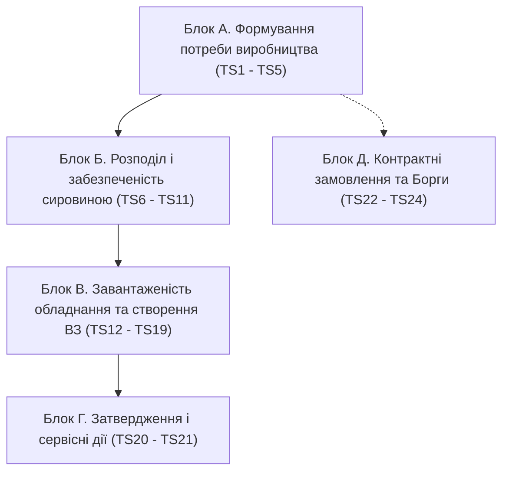

# 📋 Повний план і чек-лист тестування алгоритмів блоку «Планування виробництва» (TS1 – TS24)

> **Джерело вимог:** Офіційний документ `Тестування блоку планування виробництва.docx`  
> **Мета:** Покроковий регламент наскрізного тестування 24 тест-сценаріїв (TS1 – TS24), згрупованих у 5 функціональних блоків, із контрольними точками, формулами розрахунку та критеріями перевірки.

---

## 🧭 Рекомендована послідовність проходження блоків

---

## 🧰 Що підготувати перед стартом тестування (Master Data Pre-requisites)
* [ ] **План ГП (`GenPlanFinishProduct`):** Затверджений місячний план із продуктами (частина з техкартами, частина без для негативних тестів).
* [ ] **Продукти всіх категорій:** ГП, НФ (2+ рівнів вкладеності), сировина, матеріали — з прив'язаними активними техкартами і нормами витрат.
* [ ] **Обладнання:** Реактори (з калібрувальними точками **50% / 75% / 95%** продуктивності) та автомати ліній (фасування, упаковка).
* [ ] **Робочі зміни (`GenWorkShift`):** Створені виробничі зміни на тиждень тестового Плану виробництва (`07.09 – 13.09`).
* [ ] **Постачальники:** Контрагенти з умовами поставки (*Плече поставки*, *Люфт*, прапорець *«Пріоритет»*).
* [ ] **Контрактні замовлення (КЗ):** З продуктами, техкартами і плановими датами.
* [ ] **Складські залишки:** Залишки на складі вище та нижче мінімального ліміту (для перевірки статусів розподілу).

---

# 📦 БЛОК А. Формування потреби виробництва (TS1 – TS5)

### TS1. БП перевірка наявності Техкарти в картці ГП (`GenCheckupRoutingNameInFinDemPl`)
* **Точка запуску:** Спроба перевести План ГП у статус `Затверджено`.
* [ ] **1.1.** Продукт із декількома техкартами, жодна не обрана ➔ **Очікувано:** Система блокує затвердження та вимагає вибір ТК.
* [ ] **1.2.** Продукт з єдиною техкартою ➔ **Очікувано:** ТК підтягується автоматично, перевірка не блокує затвердження.
* [ ] **1.3.** Усі продукти мають коректно обрані техкарти ➔ **Очікувано:** План переходить у статус `Затверджено`.

### TS2. БП перевірка наявності Техкарти в контрактному замовленні (`GenCheckupRoutingNameInContrOrdPr`)
* **Точка запуску:** Спроба перевести Контрактне замовлення у статус `Затверджено`.
* [ ] **2.1.** Продукт КЗ із декількома техкартами, жодна не обрана ➔ **Очікувано:** Блокування переведення в `Затверджено`.
* [ ] **2.2.** Продукт КЗ із коректно обраною техкартою ➔ **Очікувано:** Успішне затвердження КЗ.

### TS2.2. Алгоритм 12 — Валідація Планової дати виконання КЗ
* **Точка запуску:** Кнопка «Зберегти» на сторінці Контрактного замовлення.
* [ ] **2.2.1.** Введена дата $\ge$ розрахованої можливої дати виготовлення ➔ **Очікувано:** Запис зберігається без попереджень.
* [ ] **2.2.2.** Введена дата $<$ розрахованої ➔ **Очікувано:** Модальне попередження з розрахованою мінімальною датою.
* [ ] **2.2.3.** Клік «Підтвердити» у попередженні ➔ **Очікувано:** Дата перезаписується розрахованою датою, запис зберігається.
* [ ] **2.2.4.** Клік «Скасувати» ➔ **Очікувано:** Модалка закривається БЕЗ збереження невалідної дати в БД.
* [ ] **2.2.5.** Формула дати: Враховує повний ланцюжок циклу ГП+НФ + $(\text{Час закупівлі 7 дн.} + \text{Плече} + \text{Люфт})$ для найпізнішого дефіцитного компонента.

### TS3. Алгоритм блокування Плану ГП у статусі «Затверджено»
* **Точка запуску:** Переведення Плану ГП у статус `Затверджено`.
* [ ] **3.1.** Спроба редагувати будь-яке поле шапки чи деталі затвердженого Плану ГП ➔ **Очікувано:** Редагування заблоковане (Read-Only).

### TS4. Алгоритм 2 — Розкладання ГП на НФ та неподільні компоненти (Декомпозиція)
* **Точка запуску:** Автоматично при затвердженні Плану ГП, Контрактного замовлення або запису «Борги».
* [ ] **4.1.** Період відсутній ➔ **Очікувано:** Створюється новий запис `Розрахунок виробництва` зі статусом `Активний`.
* [ ] **4.2.** Період уже існує ➔ **Очікувано:** Новий запис не створюється, оновлюється існуючий (1 місяць = 1 розрахунок).
* [ ] **4.3.** Рекурсивна декомпозиція:
  * `Рівень 1` = Готовий продукт (ГП);
  * `Рівень 2` = Напівфабрикати (НФ);
  * `Рівень 3` = Сировина та упаковка.
* [ ] **4.4.** Кількість компонента = $\text{Норма витрат ТК} \times \text{Кількість батьківського продукту}$.
* [ ] **4.5.** Заповнено поле `Батьківський елемент` (активне посилання зв'язку).
* [ ] **4.6.** Борговий рядок із кількістю $\ne 0$ (включаючи від'ємні) ➔ потрапляє в розрахунок; борг $= 0$ ➔ не потрапляє.

### TS5. Перевірка логіки періодів створення/оновлення «Розрахунків виробництва»
* [ ] **5.1.** Усі джерела попиту за один календарний місяць агрегуються строго в єдиний Розрахунок виробництва за цей місяць.

---

# 🌿 БЛОК Б. Розподіл і забезпеченість сировиною (TS6 – TS11)

### TS6. Алгоритм 5 — Чистий дефіцит ГП («Продукти плану виробництва»)
* **Точка запуску:** Створення нового тижневого плану або кнопка «Оновити».
* [ ] **6.1. Перший тижневий план періоду:** Копіюється повна кількість із «Продукти Розрахунку виробництва».
* [ ] **6.2. Наступні тижневі плани місяця:** Записується $\text{Чистий дефіцит} = \text{Повна кількість} - \sum(\text{Скориговані кількості попередніх планів})$.
* [ ] **6.3.** Якщо $\text{Дефіцит} \le 0$ ➔ рядок для цього ГП не створюється.
* [ ] **6.4.** Кнопка «Оновити» ➔ додає тільки нові ГП без перерахунку існуючих рядків.

### TS7. Алгоритм 5.1 — Категорії розподілу
* **Точка запуску:** Відкриття незатвердженого Плану виробництва.
* [ ] **7.1.** Усі компоненти в наявності (з урахуванням резерву) ➔ `1. Доступні компоненти`.
* [ ] **7.2.** Дефіцитний компонент є в дорозі (підтверджені поставки) ➔ `2. В дорозі компоненти`.
* [ ] **7.3.** Дефіцитний компонент відсутній на складі та в дорозі ➔ `3. Відсутні компоненти`.
* [ ] **7.4.** Підсумкова категорія ГП присвоюється за найгіршим компонентом ($3 > 2 > 1$).
* [ ] **7.5.** Кнопка «Показати дефіцитні компоненти» ➔ показує модальне вікно тільки з дефіцитними позиціями.

### TS8. Алгоритм 5.2 — Вимиті залишки ГП
* [ ] **8.1.** Якщо $\text{Доступно всього} \le \text{Мінімальний залишок}$ ➔ встановлюється прапорець **«Вимиті залишки ГП»**.
* [ ] **8.2.** Швидкий фільтр «Вимиті залишки ГП» коректно фільтрує таблицю.

### TS9. Алгоритм 5.2.2 — Мінімальні залишки продуктів
* [ ] **9.1.** При затвердженні Плану ГП створюється/оновлюється запис у довіднику «Мінімальні залишки продуктів» (якщо нове значення більше).

### TS10. Алгоритм 5.3 — Розподіл ГП-конкурентів за спільну сировину
* **Точка запуску:** Встановлення/зняття чекбокса «Включити до плану» (або «До виробництва»).
* [ ] **10.1.** При включенні ГП доступна кількість спільних компонентів зменшується ➔ категорії ГП-конкурентів динамічно перераховуються.
* [ ] **10.2.** При знятті чекбокса доступний залишок відновлюється ➔ категорії повертаються назад.

### TS11. Алгоритм 5.4 — Модальне вікно ГП-конкурентів («Показати спільну сировину»)
* [ ] **11.1.** Виділення одного рядка + клік «Показати спільну сировину» ➔ модалка відображає перелік продуктів-конкурентів.
* [ ] **11.2.** Множинний вибір рядків для цієї дії заблоковано системою.

---

# 🏭 БЛОК В. Завантаженість обладнання та створення ВЗ (TS12 – TS19)

### TS12. Алгоритм 1 — % завантаженості обладнання за типом
* **Точка запуску:** Активація чекбокса «Включити до плану» на вкладці «Продукти плану виробництва».
* [ ] **12.1.** Якщо поле «Скоригована кількість» порожнє ➔ попередження *«Внесіть кількість до виробництва»*.
* [ ] **12.2.** Розрахунок % завантаження типу в лівій панелі:
  $$\% \text{ завантаження} = \frac{\text{Час виготовлення ГП+НФ}}{\text{Доступні години типу за тиждень}} \times 100$$
* [ ] **12.3.** При включенні декількох ГП із тим самим типом обладнання % підсумовується кумулятивно в реальному часі.

### TS13. Алгоритм 4 — Створення Виробничих замовлень («Запланувати виробництво»)
* **Точка запуску:** Кнопка **«Запланувати виробництво»**.
* [ ] **13.1.** Створюються Виробничі замовлення (ВЗ) у статусі `Чернетка` для всіх відмічених ГП та їхніх НФ.
* [ ] **13.2.** Виробничі завдання мають статус `Не розпочато` (поля Обладнання/Зміна поки порожні).
* [ ] **13.3.** Колонка «Включити до плану» блокується для редагування.
* [ ] **13.4. Перевірка чистої потреби НФ перед створенням ВЗ (Варіанти А/Б/В):**
  * **Варіант А** ($\text{Доступно на дату} \ge \text{Потреба}$): ВЗ на цей НФ **не створюється взагалі**.
  * **Варіант Б** ($0 < \text{Доступно} < \text{Потреба}$): ВЗ створюється на **різницю** ($\text{Потреба} - \text{Доступно}$).
  * **Варіант В** ($\text{Доступно} \le 0$): ВЗ створюється на **повну потребу**.

### TS14. Алгоритм 7 — Пропозиції роз'єднання / об'єднання ВЗ
* [ ] **14.1.** Якщо $\text{Кількість ВЗ} > \text{Макс. потужність найбільшого реактора}$ ➔ ознака **«Рекомендовано до роз'єднання»**.
* [ ] **14.2.** Якщо $\text{Кількість ВЗ} < 50\% \text{ мін. потужності найменшого реактора}$ ➔ ознака **«Рекомендовано до об'єднання»**.
* [ ] **14.3.** Кнопка «Роз'єднати» активна тільки для придатних записів і відкриває модальне вікно з комбінаціями ємностей реакторів.

### TS15. Алгоритм 10 — Виконавче роз'єднання ВЗ
* [ ] **15.1.** Створюються нові ВЗ з новими кількостями, старе ВЗ отримує `GenGroupingState = "Розділено"` та статус `Скасовано`.
* [ ] **15.2.** Каскадний перерахунок піднімається по ланцюжку до ГП з округленням штук **вгору**.

### TS16. Алгоритм 10.1 — Виконавче об'єднання ВЗ
* [ ] **16.1.** Об'єднання замовлень із різними продуктами або із сумою > місткості реактора ➔ заблоковано з попередженням.
* [ ] **16.2.** Успішне об'єднання: створюється одне нове агрегуюче ВЗ, старі отримують статус `Об'єднано` та лінк на нове ВЗ.

### TS17. Алгоритм 4.1 — Автопідбір обладнання («Підібрати обладнання»)
* **Точка запуску:** Кнопка **«Підібрати обладнання»** на вкладці «Виробничі замовлення».
* [ ] **17.1.** Обираються завдання у статусі `Чернетка` з порожнім полем `Обладнання`.
* [ ] **17.2.** Відбирається активне обладнання (`Статус = "В роботі"`), що відповідає типу з техкарти.
* [ ] **17.3.** Обирається одиниця обладнання з % завантаження, **найближчим до 80%**.
* [ ] **17.4.** $\text{Start time} = \text{найпізніший End time}$ попередніх завдань на цьому обладнанні в межах плану.
* [ ] **17.5.** При перевищенні тижневого ліміту 80% (32 год) ➔ виводиться модальне попередження *(«Обладнання вже завантажено більше ніж на 80%. Продовжити?»)*.

### TS18. Алгоритм 4.2 — Розрахунок тривалості завдань (ВТВЗ)
* [ ] **18.1. Для ГП:** Тільки завдання «Фасування» та «Пакування» (без реакторів). $\text{Тривалість} = \text{Кількість} / \text{Продуктивність}$.
* [ ] **18.2. Для НФ на Реакторах:**
  * $\text{Значення 1} = \text{Обсяг} \times \text{Норма часу з типового завдання}$;
  * $\text{Значення 2}$ = Інтерполяція за точками 50% ($Min$), 75%, 95% ($Max$);
  * $\text{Підсумкова тривалість завдання} = \max(\text{Значення 1}, \text{Значення 2})$;
  * $\text{Загальна тривалість ВЗ} = \sum \text{тривалостей усіх завдань ВЗ}$.

### TS19. Алгоритм 9 — % завантаженості виробничих ліній (Гант)
* [ ] **19.1.** Розраховується % завантаження кожної одиниці обладнання від фонду робочих змін тижня.
* [ ] **19.2.** Завантаження лінії визначається за її **«вузьким місцем»** (одиниця з максимальним %).
* [ ] **19.3.** Дані зберігаються в таблиці `GenProductionPlanEquipment` для побудови діаграми Ганта.

---

# 🔒 БЛОК Г. Затвердження і сервісні дії (TS20 – TS21)

### TS20. Алгоритм 6 — Затвердження Плану виробництва
* **Точка запуску:** Кнопка **«Затвердити»** у шапці Плану виробництва.
* [ ] **20.1.** Спливає модальне вікно підтвердження.
* [ ] **20.2.** Рядки без позначки «Включити до плану» автоматично видаляються з плану.
* [ ] **20.3.** Виробничі замовлення та пов'язані накладні переходять зі статусу `Чернетка` ➔ **`До виконання`**.
* [ ] **20.4.** План виробництва переходить у статус **`Затверджено`** та блокується від змін (🔒).

### TS21. Алгоритм 8 — Очищення плану (Кнопка «Очистити»)
* **Точка запуску:** Кнопка **«Очистити»** на незатвердженому Плані виробництва.
* [ ] **21.1.** Після підтвердження всі створені ВЗ, виробничі завдання та накладні видаляються.
* [ ] **21.2.** Колонка «Включити до плану» на вкладці продуктів розблоковується для нового вибору.

---

# 📑 БЛОК Д. Контрактні замовлення та Борги (TS22 – TS24)

### TS22. Алгоритм 12 — Перевірка строків виконання Контрактних замовлень
* [ ] **22.1.** Перевірка розрахунку мінімального терміну з урахуванням тривалості виробництва та плеча доставки сировини.

### TS23. Алгоритм 11.1 — Борг планування виробництва
* **Точка запуску:** Автоматично 01 числа кожного місяця о 00:05.
* [ ] **23.1.** Розраховується $\text{Борг планування} = \text{Сумарна місячна потреба} - \sum(\text{Заплановано в тижневих планах})$.
* [ ] **23.2.** При $\text{Борг} > 0$ створюється запис у розділі «Борги» з категорією `Борг планування` на наступний місяць.

### TS24. Алгоритм 11.2 — Борг фактичного виробництва
* **Точка запуску:** Переведення ВЗ у статус `Виконано`.
* [ ] **24.1. Недовиробництво ($\text{Факт} < \text{План}$):** Різниця фіксується як додатний борг у розділі «Борги» з категорією `Борг виробництва`.
* [ ] **24.2. Перевиробництво ($\text{Факт} > \text{План}$):** Від'ємне значення зменшує накопичений борг.
