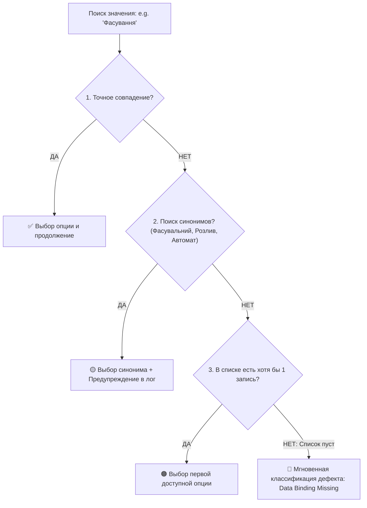

# 🛡️ Руководство по обеспечению 100% стабильности UI-тестов Creatio (Xlab Stability Guide)

Данный документ содержит обязательные архитектурные правила, паттерны и решения для устранения флакующих падений (flaky tests) при автоматизации Creatio Freedom UI.

---

## 🛑 1. Проблема переноса пакетов и пустых справочников (Lookup Data Binding)

### В чем корень проблемы:
* В Creatio выпадающие списки (например, `Тип обладнання`, `Категорія продукту`, `Одиниця виміру`, `Статус`) ссылаются на таблицы-справочники в БД (`GenEquipmentType`, `ProductCategory` и др.).
* При переносе пакетов между серверами разработчики часто включают в пакет **схемы и страницы**, но **забывают добавить привязку данных (Data Binding)**.
* **Симптом:** Список открывается, но отображает `«Немає даних»` или нужное значение переименовано (например, `"Фасування"` вместо `"Фасувальний автомат"`).

### 🛠️ Архитектурное решение в автотестах (3-уровневый Smart Fallback):



1. **Exact Match (Точное совпадение):** Поиск опции `mat-option` с точным совпадением текста без учета регистра.
2. **Fuzzy / Synonym Fallback (Мягкий поиск):** Если точного совпадения нет, проверяются синонимы (например, для фасовки: `Фасувальний`, `Розлив`, `Пакування`, `Автомат`).
3. **Graceful Fallback:** Если специфического варианта нет, выбирается первый доступный рабочий вариант из справочника, чтобы не блокировать сквозной тест.
4. **Fast Defect Attribution:** Если список пуст, тест не ждет таймаут 30 секунд, а мгновенно фиксирует:
   > `[CATEGORY C: SEED/DATA BINDING BUG] Справочник "Тип обладнання" пуст на сервере. Не перенесены данные пакета.`

---

## ⚡ 2. Ликвидация «слепых» `waitForTimeout` и работа с масками загрузки

### Правило:
**Строгий запрет** на использование фиксированных пауз `await page.waitForTimeout(3000..6000)` для ожидания готовности интерфейса.

### Как делать правильно:
1. Ожидать исчезновения оверлеев и спиннеров Creatio:
   ```typescript
   // В BasePage.ts:
   await this.page.locator('.crt-loading-mask, .crt-mask, mat-spinner, .mat-mdc-progress-spinner')
     .waitFor({ state: 'hidden', timeout: 30000 });
   ```
2. Использовать Web-First Assertions Playwright с авто-опросом DOM:
   ```typescript
   await expect(page.getByRole('button', { name: 'Затвердити' })).toBeVisible({ timeout: 15000 });
   ```

---

## 🚫 3. Запрет «тихих пропусков» через `if (await isVisible())`

### В чем опасность:
```typescript
// ❌ АНТИПАТТЕРН: Если поле рендерилось на 100 мс дольше, оно тихо пропускается!
if (await startDateField.isVisible({ timeout: 5000 }).catch(() => false)) {
  await startDateField.fill(startDateStr);
}
```
Тест тихо идет дальше, жмет «Сохранить» и падает на другом шаге с непонятной ошибкой.

### Как делать правильно:
```typescript
// ✅ ПРАВИЛЬНО: Строгое ожидание и заполнение обязательного поля
await startDateField.waitFor({ state: 'visible', timeout: 15000 });
await startDateField.fill(startDateStr);
```

---

## 🏎️ 4. Защита от гонки состояний в Angular CDK Combobox (`crt-combobox`)

При вводе текста в выпадающий список Creatio запускает асинхронный поиск в базе данных. Если кликнуть по опции до завершения фильтрации, DOM перерисуется и возникнет `stale element reference`.

### Регламент выбора из комбобокса:
1. Кликнуть по инпуту комбобокса.
2. Дождаться появления оверлей-панели `.cdk-overlay-pane`.
3. Ввести поисковый запрос (дебаунс 400–600 мс).
4. Дождаться завершения индикатора поиска (`crt-combobox-search`).
5. Кликнуть по целевому `mat-option` строго **БЕЗ `force: true`**, отфильтровав кнопку «+ Додати новий».

---

## 🔒 5. Изоляция данных через `Run ID` (Zero Collisions)

Чтобы тесты не зависели от ручных действий тестировщиков или параллельных запусков:
* Каждый запуск генерирует уникальный суффикс `_E2E_${Date.now().toString().slice(-5)}`.
* Названия создаваемых продуктов, оборудования, смен и планов содержат этот ID (например: `Шампунь_E2E_84921`).
* Это гарантирует 100% чистый прогон без конфликтов дублирования кодов и артикулов.

---

## 🌐 6. Динамическое окружение (`getShellUrl`)

Никогда не хардкодить абсолютные домены `https://xlab-analyst-main...` в коде страниц и тестов. Все пути формируются строго через хелпер:
```typescript
import { getShellUrl } from '../../src/config/environment';

await page.goto(getShellUrl('#Section/GenEquipment_ListPage'));
```
Это обеспечивает мгновенную и бесшовную работу на обоих серверах (`main` и `main2`).
