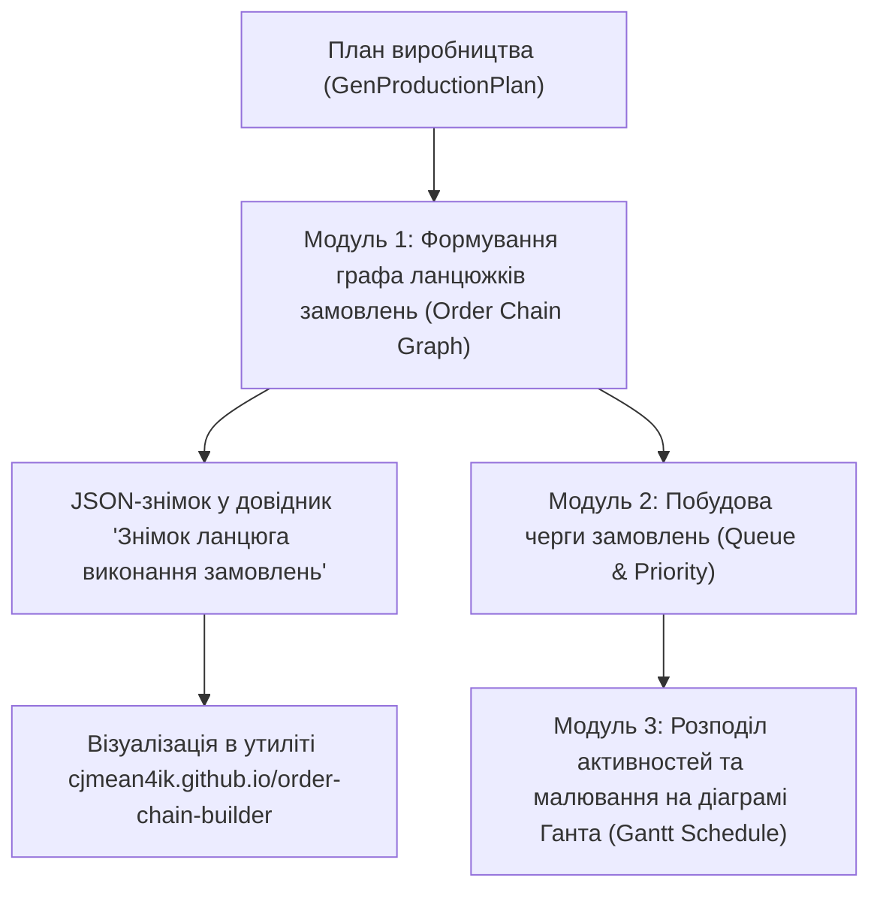
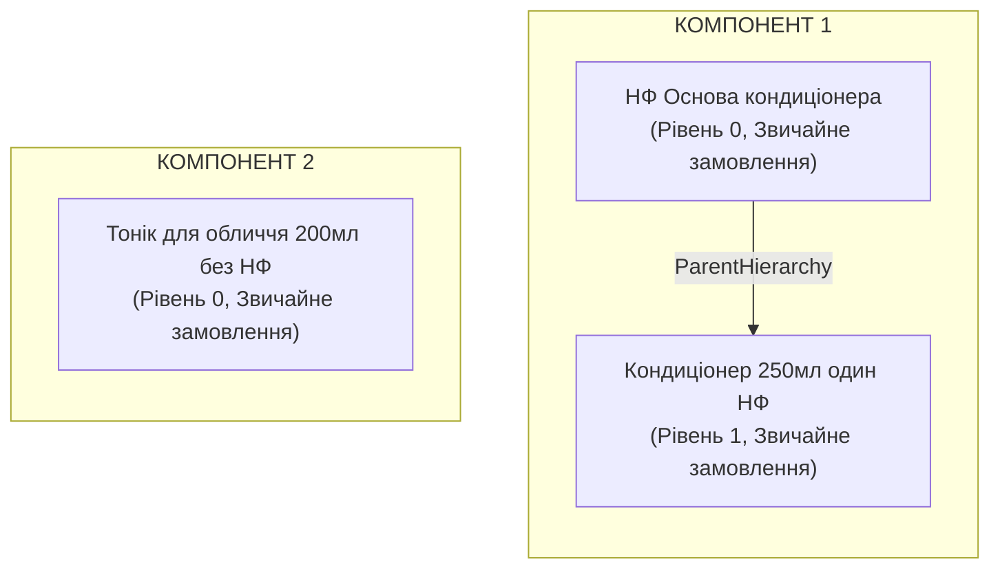

# 📄 Специфікація бізнес-вимог та аналіз відеозапису: APS Алгоритм побудови ланцюжків виробничих замовлень

> **Джерело**: Відеозапис зустрічі `video1761218469.mp4` («Зал персональної конференції Галина Петренко»)  
> **Дата запису**: 29.09.2026 10:02 – 10:36 (Тривалість: 33 хв 57 сек)  
> **Учасники**: Галина Петренко (Product Owner / Business Analyst), Богдан (Automation QA Engineer)  
> **Аналітик**: BMAD Requirements Analyst Agent  
> **Статус**: `Формалізовано / Впроваджено в тест-план`

---

## 🎯 1. Контекст та мета зустрічі

Основна мета зустрічі — передача бізнес-логіки та технічних вимог до **алгоритму побудови ланцюжків виробничих замовлень (Order Chains / Execution Graph)** у системі **Creatio 8.x Freedom UI (модуль APS / Виробництво)**, розробленого розробником Стасом.

Поточні демо-дані системи є простими (1–2 продукти), що не дозволяє протестувати складні граничні випадки. Необхідно:
1. Розібрати принципи роботи **3 послідовних модулів планування**.
2. Зрозуміти логіку формування JSON-знімку ланцюга (`Знімок ланцюга виконання замовлень`) та його візуалізації в інструменті `order-chain-builder`.
3. Зафіксувати правила поведінки зв'язків: **жорсткий зв'язок** (суцільна лінія) vs **гнучкий зв'язок** (пунктирна лінія), каскадне поширення галочки «Планувати разом з батьківським замовленням».
4. Зафіксувати логіку **об'єднання (агрегації)** та **роз'єднання** замовлень.
5. Забезпечити масовий генеративний сидинг тестових даних (10–15 ГП, до 20 НФ, 1–4 рівні BOM, 1–3 гілки) без видалення існуючих даних.

---

## 🧩 2. Архітектура процесу планування: 3 послідовні модулі



### Модуль 1. Формування ланцюжка замовлень (Order Chain Builder)
- Бере всі створені виробничі замовлення в поточному плані виробництва.
- Визначає ієрархічні зв'язки «Батьківський ГП ➔ Дочірні НФ» на всю глибину специфікації BOM (до 4 рівнів).
- Враховує об'єднання однакових НФ з різних ГП в одне агреговане замовлення та роз'єднання завеликих партій.
- Визначає тип зв'язку для кожного ребра графа: **жорсткий** (solid) чи **гнучкий** (dashed).
- Результат записується в довідник Creatio **«Знімок ланцюга виконання замовлень»** у форматі JSON.

### Модуль 2. Побудова черги замовлень (Queue Builder)
- Впорядковує всі замовлення у чергу виконання (`queue`) з визначенням `position` та `priority`.
- Замовлення найнижчого рівня (Рівень 0 — вихідні НФ першої варки) повинні бути виконані раніше замовлень вищого рівня (Рівень 1, 2... і фінальний розлив ГП).
- Контрактні замовлення отримують найвищий пріоритет (`isContractOrder: true`).

### Модуль 3. Розподіл активностей на діаграмі Ганта (Gantt Placement & Constraints)
- Розгортає кожне замовлення в набір виробничих завдань/активностей (варка, фасування, етикетування).
- Розкладає завдання по часовій шкалі з урахуванням:
  - Робочих змін (`GenWorkShift`).
  - Доступності обладнання та продуктивності ліній (реактори, дозатори, лінії етикетування).
  - Валідацій перевантаження (попередження при завантаженні > 80%).
  - Типу зв'язку: при перетягуванні блоку із **жорстким зв'язком** залежні блоки зсуваються синхронно; при **гнучкому зв'язку** — блоки можуть переміщуватися окремо в межах допустимого вікна.

---

## 🏛️ 3. Участвуючі сутності Creatio та системні об'єкти

| Сутність Creatio | Технічна назва | Призначення у процесі |
| :--- | :--- | :--- |
| **План виробництва** | `GenProductionPlan` | Картка плану, кнопки «Створити ланцюжок», «Запланувати активності», вкладка «Замовлення в потоці» (Гант). |
| **Виробниче замовлення** | `GenProductionOrder` | Замовлення на випуск ГП або варіння НФ. Містить статус, категорію, посилання на ТК, ознаку «Контрактне замовлення», вкладку «Підпорядковані замовлення». |
| **Технологічна карта** | `GenProductionRouting` | Норми витрат, етапи, типові завдання, обладнання. |
| **Сировина / матеріали ТК** | `GenRoutingProductMaterials` | Вказує витрати компонентів. **Ключове поле**: чекбокс `Планувати разом з батьківським замовленням` (жорсткий зв'язок). |
| **Знімок ланцюга виконання замовлень** | Довідник `GenOrderChainSnapshot` / Lookup | Зберігає повний JSON результат пайплайна (версія, кількість компонентів, рівні, ребра). |

---

## 🧮 4. Формалізація бізнес-правил та алгоритмів

### 🔹 Правило 1. Розпізнавання та декомпозиція НФ у замовлення
1. При створенні плану виробництва голова (ГП) розкладається на компоненти згідно з її ТК.
2. Система ітерується по всіх рядках деталі «Сировина / матеріали продукту»:
   - Якщо `Категорія продукту == "Матеріали"` (флакон, кришка, етикетка, барвник) ➔ окреме виробниче замовлення **НЕ створюється**.
   - Якщо `Категорія продукту == "Напівфабрикат"` ➔ для нього створюється **власне виробниче замовлення** на відповідну розраховану кількість.
3. Для створеного замовлення на НФ відкривається його ТК і процес рекурсивно повторюється для всіх вкладених НФ на 2, 3 та 4 рівні.

### 🔹 Правило 2. Об'єднання (Агрегація) напівфабрикатів
1. Якщо один і той самий НФ (наприклад, `НФ 1`) потрібен для кількох різних ГП (наприклад, `ГП 1` та `ГП 2`), система дозволяє об'єднати їх у спільну варку:
   - Створюється нове **Агрегуюче виробниче замовлення** (`isAggregate = true`) на сумарну масу.
   - Вихідні індивідуальні замовлення на цей НФ переводяться в статус **`Скасовано`**.
   - З вихідних замовлень видаляються всі внутрішні виробничі завдання.
   - У вихідних замовленнях заповнюються поля:
     - `Стан групування` = **`Об'єднано`**
     - `Агрегуюче замовлення` = посилання на нове створене замовлення.
2. Агреговане замовлення може мати власні вкладені НФ, які також можуть бути об'єднані каскадно.

### 🔹 Правило 3. Роз'єднання замовлень
1. Якщо розрахована партія НФ перевищує максимальну місткість реактора (наприклад, партія 2400 кг при реакторах максимум 1000 кг), замовлення роз'єднується на частини:
   - Вихідне замовлення переводиться в статус **`Скасовано`**.
   - Створюються дочірні виробничі замовлення на допустимі партії.
   - У дочірніх замовленнях заповнюється `Агрегуюче замовлення` (посилання на вихідне скасоване).

### 🔹 Правило 4. Жорсткий vs Гнучкий зв'язок (Solid vs Dashed) та каскадне спадкування
Це одне з найважливіших правил, обговорених на зустрічі (хвилини 28:00 – 31:30):
- **Галочка в ТК**: У ТК для напівфабрикату є чекбокс **«Планувати разом з батьківським замовленням»** (жорсткий зв'язок).
- **Пряме спадкування**: При створенні виробничого замовлення значення цього чекбокса переноситься у виробниче замовлення.
- **Правило об'єднання (Агрегації)**:
  $$\text{IsHardLink}_{\text{agg}} = \bigvee_{i=1}^n \text{IsHardLink}_i$$
  > **Формулювання**: Якщо однаковий напівфабрикат входить до складу кількох продуктів, і **хоча б в одному місці (хоча б для одного ГП) стояла галочка жорсткого зв'язку**, а в інших не стояла — при їхньому об'єднанні **жорсткий зв'язок автоматично активується та поширюється на всю гілку вниз**!
- **Візуальний наслідок**:
  - Якщо зв'язок жорсткий ➔ лінія **суцільна** (solid). При зсуві в Ганті замовлення рухаються синхронно.
  - Якщо зв'язок гнучкий (галочки немає в жодній гілці) ➔ лінія **пунктирна** (dashed). Можливий вільний зсув у межах доступного часу.

### 🔹 Правило 5. Контрактні замовлення
- Ознака `Контрактне замовлення` виводиться в реєстрі `Виробничі замовлення`.
- Якщо у батьківського ГП стоїть ця ознака, вона визначає найвищий пріоритет у черзі планування для самого замовлення та всього дерева його напівфабрикатів.

---

## 🖥️ 5. Інструмент візуалізації та формат JSON

### Зовнішній візуалізатор:
- **URL**: [https://cjmean4ik.github.io/order-chain-builder/](https://cjmean4ik.github.io/order-chain-builder/)
- **Автор**: Стас.
- **Призначення**: Валідація структури дерева та перевірка коректності генерації зв'язків.



### Структура JSON знімка (`Знімок ланцюга виконання замовлень`):
```json
{
  "schemaVersion": 1,
  "queue": [
    {
      "componentId": "954c431f-5386-44a5-8c48-5417b7674b69",
      "position": 0,
      "priority": 2
    }
  ],
  "isAggregate": false,
  "isContractOrder": false,
  "edges": [
    {
      "source": "cfed7f9b-64fcd4...",
      "target": "5cd19e90-293884...",
      "type": "ParentHierarchy",
      "isHardLink": true
    }
  ],
  "levels": [
    {
      "level": 0,
      "orderIds": ["cfed7f9b-64fcd4..."]
    },
    {
      "level": 1,
      "orderIds": ["5cd19e90-293884..."]
    }
  ]
}
```

---

## 🚦 6. Результати обговорення поточних автотестів (хв 20:45)

Богдан продемонстрував поточний звіт прогону:
- **Успішних тест-кейсів**: **54**
- **Впавших тест-кейсів**: **35**
- **Виявлені системні дефекти та розбіжності UI Creatio Freedom UI**:
  1. *Модальні вікна*: Відсутнє поле «Ціна» в очікуваному списку полів.
  2. *Реєстри складських документів*: Відсутня колонка «Тип складських операцій».
  3. *Залишки*: Відсутня колонка «В резерві залишку».
  4. Потрібна уніфікація колонок у словниках `src/locators/*.json`.

---

## 🧪 7. Вимоги до тестового датасету (Data Seeding Requirements)

Для повноцінної верифікації алгоритму Галина та Богдан погодили створення спеціального розширеного пулу тестових даних:
1. **Готова продукція (ГП)**: 10–15 найменувань із різними характеристиками.
2. **Напівфабрикати (НФ)**: до 20 найменувань.
3. **Технологічні карти (ТК)**:
   - Глибина вкладеності BOM: від **1 до 4 рівнів**.
   - Розгалуження: від **1 до 3 напівфабрикатів** у складі однієї карти.
   - Варіативність зв'язків: наявність комбінацій з увімкненою та вимкненою галочкою «Планувати разом з батьківським замовленням» для перевірки поширення жорсткого зв'язку.
4. **Ізоляція**: Дані повинні маркуватися префіксом `[XTEST]` або заводитися на тестовому сервері `main2`, щоб не блокувати операційну роботу на `main`.

---

## ✅ 8. Acceptance Criteria (Критерії приймання алгоритму)

- [ ] **AC-01 (Декомпозиція BOM)**: При натисканні «Створити ланцюжок» у плані виробництва для кожного вкладеного НФ формується відповідне замовлення з точним розрахунком потреби до найглибшого рівня (рівень 4).
- [ ] **AC-02 (Агрегація замовлень)**: При злитті двох замовлень на однаковий НФ вихідні замовлення набувають статусу `Скасовано`, їхні завдання очищуються, а `Стан групування` встановлюється в `Об'єднано`.
- [ ] **AC-03 (Поширення жорсткого зв'язку)**: Якщо хоча б в одного замовлення при об'єднанні встановлено прапорець «Планувати разом з батьківським замовленням», результуюче замовлення та вся гілка отримують суцільний (жорсткий) зв'язок.
- [ ] **AC-04 (Коректність JSON Snapshot)**: Запис у довіднику `Знімок ланцюга виконання замовлень` містить валідний JSON зі збереженням усіх вершин (`levels`), ребер (`edges`) та черги (`queue`).
- [ ] **AC-05 (Валідація у візуалізаторі)**: Експортований JSON успішно імпортується в `order-chain-builder` без помилок рендерингу графа.
- [ ] **AC-06 (Діаграма Ганта)**: Замовлення із жорстким зв'язком відображаються суцільними лініями і переміщуються синхронно; із гнучким — пунктирними лініями.
